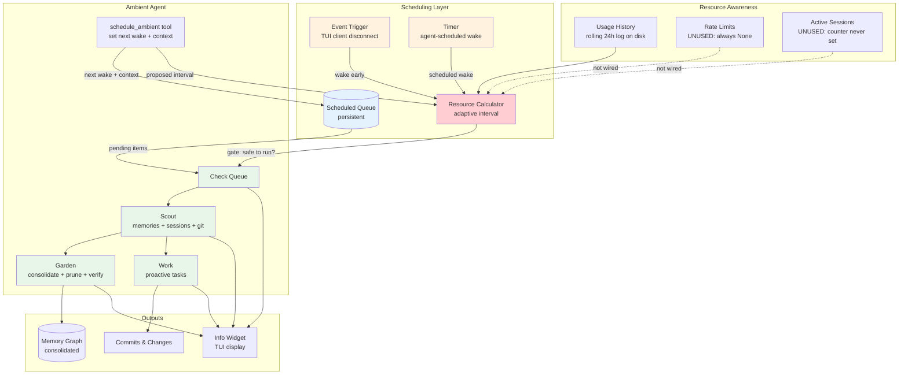
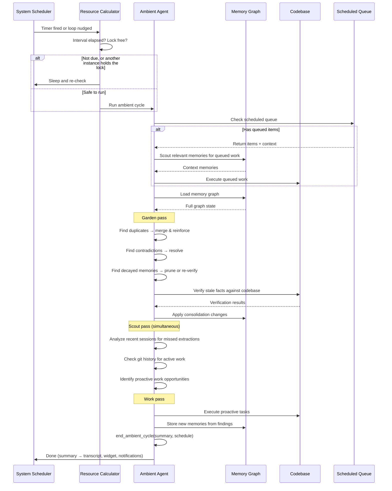
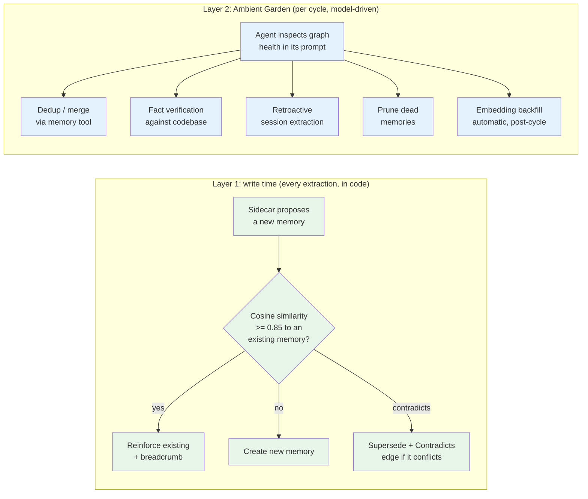
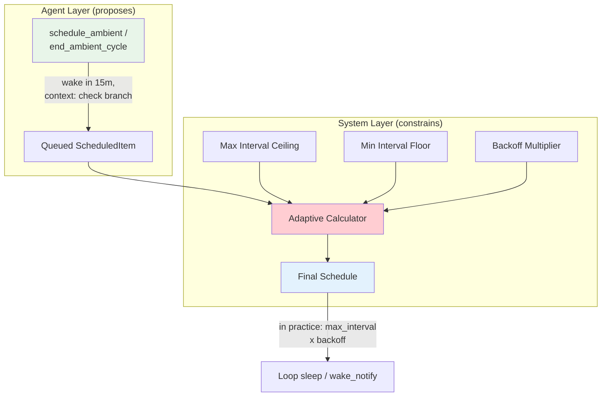
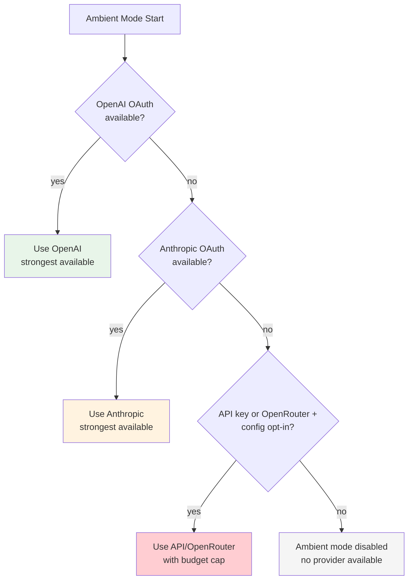
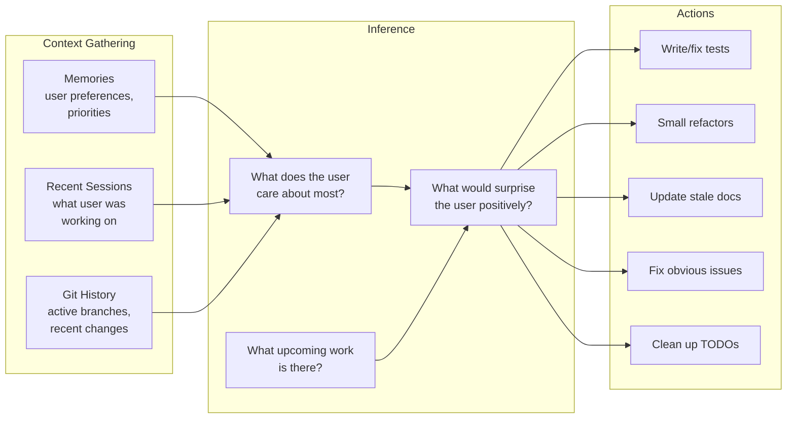
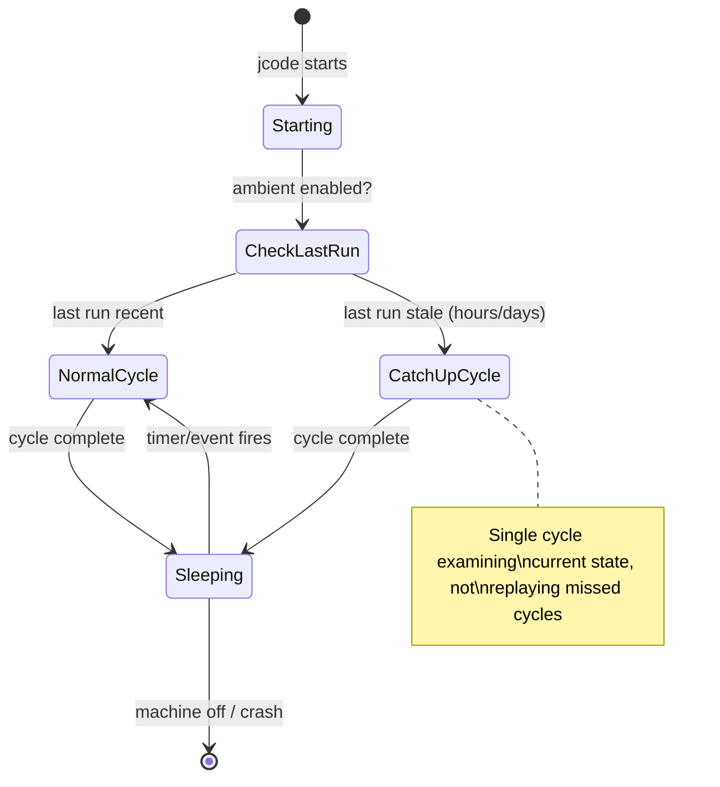

# Ambient Mode

> **Status:** Shipped — the loop, the ambient tools, the adaptive scheduler,
> the notification fan-out and the TUI widget all run today. Several pieces
> described below were never built; each is flagged inline and listed under
> [Not built](#not-built).
>
> **Updated:** 2026-09-05

A proactive, always-on agent mode that works autonomously without user prompting. Like a brain consolidating memories during sleep, ambient mode tends to the memory graph, identifies useful work, and acts on the user's behalf — all while staying within resource limits.

## Overview

Ambient mode operates as a background loop that:
1. **Gardens** — consolidates, prunes, and strengthens the memory graph
2. **Scouts** — analyzes recent sessions, git history, and memories to understand what the user cares about
3. **Works** — proactively completes tasks the user would appreciate being surprised by

These aren't separate phases. The agent does all three in a single pass — while looking at memories it naturally discovers maintenance work and identifies proactive opportunities simultaneously.

**Key properties:**
1. **Single agent at a time** — a PID lock file (`~/.jcode/ambient/ambient.lock`)
   makes one cycle exclusive across every jcode process on the machine
2. **Uses the server's provider** — each cycle forks whatever provider the
   shared server was started with. There is no ambient-specific provider or
   model selection
3. **Self-scheduling, sort of** — the agent records its next intent via
   `end_ambient_cycle` / `schedule_ambient`, which enqueues a `ScheduledItem`
   carrying the context. The loop's actual sleep is computed by the adaptive
   scheduler and clamped to `[min_interval_minutes, max_interval_minutes]`,
   so the agent controls *what* the next cycle does more than *when* it runs
4. **Off by default** — `ambient.enabled` defaults to `false`. The runner loop
   itself always starts, because session-targeted scheduled tasks are
   delivered by the same loop

---

## Not built

Everything in this list is described somewhere below as a design idea. None of
it exists in the code:

- **Provider/model selection chain.** There is no "OpenAI OAuth → Anthropic
  OAuth → pay-per-token opt-in → disabled" priority. The cycle forks the
  server's provider. `ambient.model` can be set (config, `JCODE_AMBIENT_MODEL`,
  or the TUI config editor) but nothing reads it when running a cycle, so it
  currently has no effect.
- **Rate-limit-aware budgeting.** `AdaptiveScheduler::calculate_interval`
  accepts rate-limit info, but every caller passes `None`, so the token-budget
  arithmetic never runs. In practice the interval is always
  `max_interval_minutes`, multiplied by the backoff factor.
- **Cold-start gating.** The system prompt tells the agent to scout for
  proactive work "only if enabled and past cold start", but there is no
  cold-start counter, no warm-up period and no opt-in switch. Nothing gates it.
- **Pausing on user activity.** `pause_on_active_session` is wired into the
  scheduler, but the runner's active-session counter is never incremented, so
  the pause branch is unreachable.
- **Budget bar in the widget.** The widget's `budget_percent` is always `None`.
- **Per-cycle checkpointing / resume-mid-cycle.** A crashed cycle is not
  resumed from a marker; the next cycle simply looks at current state.
- **Event triggers other than client disconnect.** No git-push trigger, no
  idle-threshold trigger, no `/ambient` slash command.
- **Multi-machine coordination.** Still deferred.

---

## Architecture



The dotted edges are the unbuilt parts: the runner always calls
`calculate_interval(None)`, and its active-session counter stays at zero, so
the only live inputs are the timer, the queue and the backoff multiplier.

---

## Ambient Cycle

Each ambient cycle follows a single flow. The agent doesn't switch between "modes" — it naturally handles gardening, scouting, and work in one pass.



---

## Ambient Agent Tools

The ambient agent gets the normal tool registry plus three ambient-only tools:
`end_ambient_cycle`, `schedule_ambient` and `send_message`.

### `end_ambient_cycle` (required)

Every ambient cycle **must** end with this tool call. Its summary lands in the
persisted transcript, the TUI widget and the cycle notification.

```json
{
    "summary": "Merged 3 duplicate memories, pruned 2 stale facts,
                extracted memories from crashed session jcode-red-fox-1234",
    "memories_modified": 8,
    "compactions": 2,
    "proactive_work": null,
    "next_schedule": {
        "wake_in_minutes": 25,
        "context": "Verify 4 remaining stale facts"
    }
}
```

| Field | Required | Description |
|-------|----------|-------------|
| `summary` | yes | Human-readable summary of what was done (goes into the transcript, widget and notification) |
| `memories_modified` | yes | Count of memories created/merged/pruned/updated |
| `compactions` | yes | Number of context compactions during this cycle |
| `proactive_work` | no | Description of proactive code changes, if any |
| `next_schedule` | no | When to wake next + context. Omitted → nothing is enqueued and the loop just re-sleeps for the calculated interval |

`next_schedule` takes `wake_in_minutes`, `context` and `priority`
(`low`/`normal`/`high`). A `next_schedule` without `wake_in_minutes` defaults
to 30 minutes from now.

### `schedule_ambient`

Can also be called mid-cycle to queue future work. Only `context` is required:

```json
{
    "wake_in_minutes": 15,
    "context": "Check the auth refactor branch for merge conflicts",
    "priority": "normal"
}
```

### `send_message`

Pushes a message out through the configured notification channels (see
[Notifications](#notifications)) so the user can follow a cycle without
opening jcode. Optionally targets one channel by name; with no channel it
goes to all of them. The system prompt asks the agent to use it when it
starts a cycle and when it finishes significant work.

### `todo`

The system prompt tells the agent to open its cycle with the standard `todo`
tool. This provides:
- Visibility into what the agent planned vs what it actually did
- If the cycle is interrupted, we know what's left
- Structure for the agent's reasoning

## Handling Unexpected Stops

The model may stop unexpectedly (output length limit, API error, random stop). The system handles this:

```mermaid
stateDiagram-v2
    [*] --> Running: Cycle started

    Running --> Stopped: Model output ends

    Stopped --> CheckTool{Called end_ambient_cycle?}

    CheckTool --> Complete: Yes → normal completion
    CheckTool --> Continuation: No → send continuation message

    Continuation --> Running: Model continues work
    Continuation --> Stopped: Model stops again

    Stopped --> ForcedEnd: Second stop without end_ambient_cycle
    ForcedEnd --> Incomplete: Generate partial transcript,\nschedule default wake

    Complete --> [*]
    Incomplete --> [*]
```

**Continuation message** (injected as user message):

```
You stopped unexpectedly without calling end_ambient_cycle.
If you are done with your work, call end_ambient_cycle with a
summary of what you accomplished and schedule your next wake.
If you are not done, continue what you were doing.
```

**If no `end_ambient_cycle` is called after two attempts:**
- The cycle is force-ended with a fixed summary
  ("Cycle ended without calling end_ambient_cycle (forced end after 2 attempts)")
- `memories_modified` and `compactions` are recorded as `0` — there is no
  metrics fallback
- The transcript is written with status `Incomplete`
- Warning logged for debugging

**If no `next_schedule` is given:**
- Nothing is added to the queue. The loop sleeps for the interval the
  scheduler computes, which in the absence of rate-limit data is
  `max_interval_minutes` (times the backoff multiplier), floored at 30s

---

## System Prompt

The ambient agent's system prompt is built fresh each cycle from real state.
The prompt gives the agent information to reason with, not rigid instructions
for how to think.

```
You are the ambient agent for jcode. You operate autonomously without
user prompting. Your job is to maintain and improve the user's
development environment.

## Current State
- Last ambient cycle: {timestamp} ({time_ago} ago) | "never (first run)"
- Active user sessions: {count} | "none"
- Total cycles completed: {count}

## Scheduled Queue
{one line per item: id, context, age, priority; plus target session /
 spawn parent, working dir, details, files, branch, extra context
 when the item carries them — or "Empty -- do general ambient work."}

## Recent Sessions (since last cycle)
{id | status | duration | topic | extraction status, per session}

## Memory Graph Health
- Total memories: {count} ({active} active, {inactive} inactive)
- Memories with confidence < 0.1: {count}
- Unresolved contradictions: {count}
- Memories without embeddings: {count}
- Duplicate candidates: run embedding scan to detect
- Last consolidation: {time_ago} ago | "never"

## User Feedback History
{summaries of the last few ambient transcripts plus memory-graph
 entries tagged "ambient"/"system", or a "none found yet" line}

## Resource Budget
- Provider: {provider name}
- Tokens remaining in window: unknown (adaptive)
- Window resets: unknown
- User usage rate: estimated from history
- Budget for this cycle: stay under 50k tokens

## User Directives (from replies)     [only when replies are pending]
{Telegram/Discord/Jade replies to previous cycle notifications,
 marked as the top priority for this cycle}

## Instructions

Use the tools that are already available to you in this session. Do
not search for tools ... Key tools for this cycle: `todo`,
`end_ambient_cycle`, `schedule_ambient`, `send_message`.

Start by using the `todo` tool to plan what you'll do this cycle.

Priority order:
1. Execute any scheduled queue items first.
2. Garden the memory graph -- consolidate duplicates, resolve
   contradictions, prune dead memories, verify stale facts,
   extract from missed sessions.
3. Scout for proactive work (only if enabled and past cold start) --
   look at recent sessions and git history to identify useful work
   the user would appreciate.

For gardening: focus on highest-value maintenance first. ...

For proactive work: be conservative. ... Code changes must go on
their own branch, never on the user's checked-out branch, and you
must report them with `send_message` before the cycle ends.

Good sources for scouting proactive work: Todoist (via MCP), Canvas
(via MCP), git history, session history.

When done, you MUST call end_ambient_cycle ...

## Messaging Check-ins
{how and when to use `send_message`}
```

Three caveats about that template:

- The **Resource Budget** block is decorative. Only the provider name is real;
  the other four lines are hardcoded strings, including the 50k-token budget,
  which nothing enforces.
- **Duplicate candidates** is always the "run embedding scan" line: computing
  it would need a full pairwise embedding scan, so the count is left at zero
  and the agent is told to discover duplicates itself.
- The **cold start** clause in instruction 3 has no implementation behind it
  (see [Not built](#not-built)).

---

## Resource Budget & Interval Calculation

`AdaptiveScheduler` (`crates/jcode-app-core/src/ambient/scheduler.rs`) owns
both the usage log and the interval arithmetic.

### Tracking

The record type is:

```rust
pub struct UsageRecord {
    pub timestamp: DateTime<Utc>,
    pub source: UsageSource,      // User | Ambient
    pub tokens_input: u32,
    pub tokens_output: u32,
    pub provider: String,
}
```

`UsageLog` keeps these in memory, saves every 10 added records
(`SAVE_INTERVAL`), prunes anything older than 24 hours on save
(`PRUNE_AGE_HOURS`), and persists to `~/.jcode/ambient/usage.json`.

**Nothing writes to it.** `UsageLog::record` has no production callers, so in
practice the log is empty and every query below returns its zero/default
branch. Wiring provider responses into `record` is the missing piece.

### Rate Limit Discovery

`RateLimitInfo { limit_tokens, remaining_tokens, limit_requests,
remaining_requests, reset_at }` is the input the interval calculation wants.
No code populates it: `calculate_interval` is always called with `None`, so
the header-scraping half of this design does not exist.

### Interval Algorithm

With `rate_limit_info = None` — i.e. always, today — the calculation is just
`apply_backoff(max_interval)`. The full path, for when rate-limit info is
eventually supplied, is:

```
# From RateLimitInfo; 1 hour is assumed when reset_at is unknown
window_remaining = reset_at - now
tokens_remaining = remaining_tokens (0 when absent)

# No headroom or no window left -> back off to max_interval
if tokens_remaining <= 0 or window_remaining <= 0:
    return apply_backoff(max_interval)

# User consumption from the rolling log, last hour, per minute
user_rate = usage_log.user_rate_per_minute(1h)
user_projected = user_rate * window_remaining_minutes

# Ambient gets the *complement* of the user reserve.
# user_budget_reserve defaults to 0.8, so ambient_fraction = 0.2:
# ambient may use at most 20% of the projected headroom.
ambient_fraction = 1.0 - user_budget_reserve
ambient_budget = (tokens_remaining - user_projected) * ambient_fraction

if ambient_budget <= 0:
    return apply_backoff(max_interval)    # wait for the window to reset

# Cost per cycle: mean total_tokens of the last 5 Ambient records,
# or 10_000 when there is no history
tokens_per_cycle = usage_log.avg_tokens_per_ambient_cycle(5) or 10_000
cycles_available = ambient_budget / tokens_per_cycle

# Spread evenly across the rest of the window
interval = window_remaining / cycles_available   if cycles_available > 0
           else window_remaining

return apply_backoff(clamp(interval, min_interval, max_interval))
```

Note the direction of the reserve: `user_budget_reserve` is the share held
*back* for the user, and ambient receives `1 - user_budget_reserve`. At the
default 0.8 that is 20% of headroom for ambient, not 80%.

`apply_backoff` multiplies by the current backoff factor and re-clamps to
`[min_interval, max_interval]`, so the ceiling always wins:

- `on_rate_limit_hit()` doubles the multiplier, saturating at **64**
- `on_successful_cycle()` resets it to **1** — there is no gradual decay
- Because the result is re-clamped to `max_interval`, backoff can only lengthen
  the interval up to that ceiling; raise `max_interval_minutes` if you want
  backoff to have visible range

The runner treats *any* cycle error as a rate-limit hit, so a failed cycle
(including a failed visible-mode spawn) doubles the multiplier.

### Behavioral Rules

| Condition | Behavior | Built? |
|-----------|----------|--------|
| Cycle failed (any error) | `on_rate_limit_hit()` — double the backoff multiplier, cap 64 | yes |
| Cycle succeeded | Backoff multiplier reset to 1 | yes |
| No rate-limit info | Interval = `max_interval_minutes` × backoff | yes (this is the only path) |
| TUI client disconnects | Loop is nudged awake and re-checks immediately | yes |
| User is active in a session | Pause ambient | no — the active-session counter is never set |
| User has been idle for hours | Run cycles more frequently | no |
| Approaching end of window with budget left | Squeeze in extra cycles | no |
| Over 80% of budget consumed | Fall back to max_interval | no |

---

## Memory Consolidation

### Two-Layer Architecture

Memory consolidation happens at two levels, mirroring how the brain encodes during the day and consolidates during sleep.



### Layer 1: Write-Time Consolidation

Runs in code on every memory write, not in the ambient cycle.

**Operations:**
- **Duplicate detection** — `remember_project` / `remember_global` embed the
  incoming entry and search the graph for a neighbour at or above
  `STORAGE_DEDUP_THRESHOLD = 0.85` cosine similarity. On a hit the existing
  memory is reinforced (with a breadcrumb) and its id is returned instead of
  inserting a duplicate. The check also runs cross-store, so a project write
  dedups against the global graph and vice versa.
- **Contradiction detection** — when the memory sidecar finds that a new
  memory contradicts an existing one, it supersedes the old entry and adds a
  bidirectional `Contradicts` edge.
- **Reinforcement** — `MemoryEntry::reinforce` bumps `strength` and appends a
  provenance breadcrumb.

**Cost:** one embedding plus a graph scan per write.

### Layer 2: Ambient Garden

Deep consolidation during an ambient cycle. This layer is **model-driven**:
the prompt hands the agent the graph health numbers and the agent decides what
to do using the ordinary `memory` tool. There is no gardening engine, and none
of the thresholds below are enforced by code — they are editorial guidance for
the agent.

| Operation | Description | Who does it |
|-----------|-------------|-------------|
| **Graph-wide dedup** | Find and merge semantically similar memories the 0.85 write-time check missed | agent, via `memory` |
| **Contradiction resolution** | Resolve existing `Contradicts` edges by checking current state (the count is in the prompt) | agent, via `memory` |
| **Fact verification** | Check factual memories against the codebase | agent, via `read`/`bash` + `memory` |
| **Retroactive extraction** | Extract from recent sessions whose extraction status is missing (also in the prompt) | agent |
| **Pruning** | Remove memories with near-zero confidence and low strength (the `confidence < 0.1` count is in the prompt) | agent, via `memory` |
| **Relationship discovery** | Find new connections between memories | agent, via `memory` |
| **Embedding backfill** | Generate embeddings for memories that lack them | **code** — the runner spawns `backfill_embeddings()` after every successful cycle |
| **Cluster refinement** | Re-run clustering on updated embeddings | not built |

See [MEMORY_ARCHITECTURE.md](MEMORY_ARCHITECTURE.md) for the graph, edge kinds
and retrieval path.

### Reinforcement Provenance

When a memory is reinforced (by write-time dedup or by the agent through the
`memory` tool), the system records a breadcrumb for traceability:

```rust
pub struct Reinforcement {
    pub session_id: String,
    pub message_index: usize,
    pub timestamp: DateTime<Utc>,
}

pub struct MemoryEntry {
    // ... existing fields ...
    pub reinforcements: Vec<Reinforcement>,
}

impl MemoryEntry {
    pub fn reinforce(&mut self, session_id: &str, message_index: usize) {
        self.strength += 1;
        self.updated_at = Utc::now();
        self.reinforcements.push(Reinforcement {
            session_id: session_id.to_string(),
            message_index,
            timestamp: Utc::now(),
        });
    }
}
```

Defined in `crates/jcode-memory-types/src/lib.rs`. The consolidation agent can
later trace back through reinforcements to understand *why* a memory has the
strength it does, and whether those reinforcements still hold.

---

## Scheduling

### Two-Layer Scheduling



A queued item's `scheduled_for` and the loop's own sleep are two separate
mechanisms. `should_run` only looks at the ambient status (`Idle`, or
`Scheduled` whose `next_wake` has passed) — it does not consult the queue, so
an ambient-targeted item that comes due does **not** by itself wake the loop
early. Session- and spawn-targeted items are different: they are delivered by
the loop as soon as they are due, and the loop shortens its own sleep to the
next such due time.

### Agent-Initiated Scheduling

The ambient agent has a `schedule_ambient` tool to request its next wake-up:

```json
{
    "wake_in_minutes": 15,
    "context": "Check the auth refactor branch for merge conflicts",
    "priority": "normal"
}
```

`wake_at` (an RFC 3339 timestamp) may be given instead of `wake_in_minutes`;
with neither, the item is scheduled 30 minutes out. The context is stored in
the scheduled queue so when the agent wakes up, it knows what it planned to do.

### Adaptive Resource Calculation

See [Resource Budget & Interval Calculation](#resource-budget--interval-calculation)
for the real formula and its constants. In summary, today:

- The interval is `clamp(max_interval × backoff, min_interval, max_interval)`,
  because no caller supplies rate-limit information
- The agent's proposed wake time controls *what* the next cycle does (queue
  context), not *when* the loop wakes: the loop's sleep comes from the
  calculator, not from `wake_in_minutes`
- A failed cycle doubles the backoff multiplier; a successful one resets it
- The pause-while-user-active branch exists but is unreachable
  (see [Not built](#not-built))

### Event Triggers

`nudge()` wakes the loop out of its sleep. There is exactly one production
caller: a main-socket client stream ending (a TUI/CLI client disconnecting).
`trigger()` additionally resets the status to `Idle` so the next check runs a
cycle; it is reachable from `jcode ambient trigger` (which goes through the
debug socket) and when a channel reply arrives with no cycle running.

| Event | Effect | Built? |
|-------|--------|--------|
| Main-socket client disconnects | `nudge()` — loop re-checks immediately | yes |
| `jcode ambient trigger` / debug `ambient:trigger` | `trigger()` — force a cycle | yes |
| Channel reply (Telegram/Discord/Jade) with no cycle running | Directive saved, then `trigger()` | yes |
| Session crashed | High-priority wake | no |
| Git push | Low-priority wake | no |
| User idle > threshold | Low-priority wake | no |
| `/ambient` slash command | Immediate | no — there is no such TUI command |

### Scheduled Queue

Persistent queue of scheduled ambient tasks:

```rust
pub struct ScheduledItem {
    pub id: String,
    pub scheduled_for: DateTime<Utc>,
    pub context: String,
    pub priority: Priority,
    pub target: ScheduleTarget,
    pub created_by_session: String,     // which session created this
    pub created_at: DateTime<Utc>,
    pub working_dir: Option<String>,
    pub task_description: Option<String>,
    pub relevant_files: Vec<String>,
    pub git_branch: Option<String>,
    pub additional_context: Option<String>,
}

pub enum Priority {
    Low,
    Normal,
    High,
}

pub enum ScheduleTarget {
    Ambient,                                  // hand to the ambient agent
    Session { session_id: String },           // deliver into a live session
    Spawn { parent_session_id: String },      // fork a child session
}
```

**Queue rules:**
- Persisted to `~/.jcode/ambient/queue.json`; survives restarts
- The whole queue is rendered into the cycle's system prompt, so the agent
  sees every pending item (not just the due ones)
- Direct-delivery items (`Session`/`Spawn`) are taken by the loop when due,
  sorted by priority descending then `scheduled_for` ascending; `Ambient`
  items stay in the queue for the agent to consume
- Expired items (past their `scheduled_for`) are still executed
- Items are never dropped for budget reasons
- Only one ambient cycle at a time — the PID lock file makes this exclusive
  across processes, and a live cycle simply defers the next check by 60s
- `Session` delivery first tries the live session over the server socket and
  falls back to a headless resume of the stored session

---

## Provider & Model Selection

> **Not built.** There is no selection chain. Documented here so the intent
> is not lost, and so nobody assumes the config keys work.

What actually happens: the server hands `run_loop` a clone of its own
`Arc<dyn Provider>`, and each cycle calls `provider.fork()`. Ambient therefore
uses whatever provider and model the shared server was started with, competing
for the same rate-limit pool as interactive sessions. `ambient.model` is
read by the config editor and the `JCODE_AMBIENT_MODEL` env override but by
nothing that runs a cycle, so setting it changes nothing.

The unimplemented design was:



**Rationale for that design:**
- **Separate pools** — putting ambient on a different subscription than the
  one in interactive use keeps ambient from eating the user's rate limit
- **Subscription first** — OAuth providers cost nothing per token, so
  pay-per-token routes should be opt-in to avoid silently burning credits
- **Strong models** — ambient needs good judgment about what work is
  valuable. A weak model would do the wrong proactive work and annoy the user

Nothing in `AmbientConfig` supports any of this today: there is no
`provider`, `allow_api_keys` or `api_daily_budget` key
(see [Configuration](#configuration)).

---

## Proactive Work

### What Ambient Does

The agent uses memories, recent sessions, and git history to identify useful work:



### Safety

Ambient work is constrained by convention rather than by an approval gate: this
fork runs without a human-in-the-loop permission queue, and the ambient agent
runs with `set_debug(true)`, i.e. with no tool gating of its own.

What the system prompt actually asks of it:
- **Own branch** — code changes go on their own branch, never on the user's
  checked-out branch
- **Report before ending** — proactive changes must be reported with
  `send_message` before the cycle ends
- **Be conservative** — check the user-feedback memories; if similar work was
  rejected before, don't repeat it

These are instructions, not enforcement: nothing inspects the branch the agent
committed on, and there is no worktree/PR requirement in the code.

What the system does guarantee:
- **Transcript per cycle** — `~/.jcode/ambient/transcripts/` gets a JSON
  transcript with status, summary, counts and the full conversation markdown
- **Notification per cycle** — the summary is pushed to the configured
  channels (see [Notifications](#notifications))
- **Reviewable in the TUI** — the widget shows the last cycle's summary
- **Same file-access rules as interactive mode** — ambient uses the ordinary
  tool registry

---

## Info Widget

The TUI info widget shows ambient status alongside the other panes (memory,
git, tokens). It renders when ambient is enabled, and also when ambient is
disabled but more than one session-targeted scheduled task is pending — that
is how scheduled reminders surface without ambient mode.

### Widget Content

```
● Running: running agent
  2 tasks queued (check the auth refactor branch)
  Ran 12m ago - merged 3 duplicates, pruned 2 stale facts
  Next run in 18m
```

**Fields:**

| Field | Description |
|-------|-------------|
| **Status** | `○ Idle` / `● Running: {detail}` / `◐ Waiting for next run` / `⏸ Paused: {reason}` / `⏰ Scheduled tasks active` / `○ Not running` |
| **Queue** | `N task(s) queued` plus the next item's description or context. With ambient disabled this switches to `N scheduled task(s)` counting only session/spawn items |
| **Last cycle** | `Ran {ago}` plus the last summary |
| **Next wake** | `Next run {countdown}`, present only while the status is `Scheduled` |
| **Budget** | Renderer exists but is never fed: `budget_percent` is always `None`, so the bar never appears |

The running detail strings come from the runner as it advances:
`gathering context`, `setting up tools`, `running agent`, `continuation turn`,
and for visible mode `launching visible TUI` / `waiting for TUI cycle`.

---

## Configuration

`AmbientConfig` has exactly six keys:

```toml
[ambient]
# Enable ambient mode (default: false)
enabled = false

# Model override (default: none). INERT: nothing reads this when running a
# cycle; the cycle forks the shared server's provider and model.
# model = "gpt-5.2-codex"

# Minimum interval between cycles in minutes (default: 5)
min_interval_minutes = 5

# Maximum interval between cycles in minutes (default: 120)
max_interval_minutes = 120

# Pause ambient when a user session is active (default: true).
# INERT: the runner's active-session counter is never updated.
pause_on_active_session = true

# Run each cycle in a visible kitty window instead of headlessly (default: true)
visible = true
```

There are no `provider`, `allow_api_keys`, `api_daily_budget`, `proactive_work`
or `work_branch_prefix` keys — those were design ideas and never existed in
`AmbientConfig`. The scheduler's `user_budget_reserve` (0.8) is also not
configurable: the runner builds `AmbientSchedulerConfig` from the three
interval/pause keys and takes the default for the rest.

Env overrides: `JCODE_AMBIENT_ENABLED`, `JCODE_AMBIENT_MODEL`,
`JCODE_AMBIENT_MIN_INTERVAL`, `JCODE_AMBIENT_MAX_INTERVAL`,
`JCODE_AMBIENT_VISIBLE`.

### Visible cycles

With `visible = true` (the default) the runner does **not** run the agent
in-process. It writes the system prompt and first message to
`~/.jcode/ambient/visible_cycle.json`, then spawns:

```
kitty --title "🤖 jcode ambient cycle" -e <jcode> ambient run-visible
```

and blocks until that process exits, then reads the cycle result back from
`~/.jcode/ambient/cycle_result.json`. If the window is closed without the
agent calling `end_ambient_cycle`, the cycle is recorded as `Incomplete` with
the summary "Visible cycle ended (user closed window)".

**`kitty` is required and hardcoded.** There is no terminal detection and no
fallback: if the spawn fails, the cycle returns an error — the log line
claiming it is "falling back to headless" is wrong, nothing falls back, and
the failure also doubles the scheduler's backoff multiplier. Set
`visible = false` (or `JCODE_AMBIENT_VISIBLE=0`) on machines without kitty.

---

## Notifications

After every completed cycle the runner builds an `AmbientTranscript`, saves it,
and hands it to `NotificationDispatcher::dispatch_cycle_summary`. The title is
`Ambient cycle: {memories} memories, {compactions} compactions`, and two
different bodies are produced:

- a **safe** body (status and counts only, no model-generated text) for
  ntfy.sh, which may be publicly readable
- a **detailed** body (markdown: summary, provider/model, counts, and the full
  conversation transcript) for local and private destinations

Transports, all fire-and-forget and all off unless configured:

| Transport | Body | Enabled by |
|-----------|------|------------|
| ntfy.sh push | safe | `safety.ntfy_topic` is set |
| Desktop notification (macOS Notification Center / `notify-send`) | detailed | `safety.desktop_notifications` (default `true`) |
| Telegram | detailed | `safety.telegram_enabled` + bot token + chat id |
| Discord | detailed | `safety.discord_enabled` + bot token + channel id |
| Jade cloud relay | detailed | `safety.jade_relay_enabled` + api base + token + session id |

There is **no email transport.** SMTP/IMAP delivery was removed along with the
`jcode-notify-email` crate; `SafetyConfig` has no `email_*` keys.

Telegram, Discord and Jade are two-way when their `*_reply_enabled` flag is
set: the runner spawns a reply poller per channel, and a reply is injected into
a running cycle as a soft interrupt, or — if no cycle is running — saved to
`directives.json` and used to trigger one. Pending directives are rendered
into the next cycle's prompt as top-priority instructions.

```toml
[safety]
ntfy_topic = "my-jcode-topic"          # unset by default
ntfy_server = "https://ntfy.sh"
desktop_notifications = true

telegram_enabled = false
telegram_bot_token = ""
telegram_chat_id = ""
telegram_reply_enabled = false

discord_enabled = false
discord_bot_token = ""
discord_channel_id = ""
discord_bot_user_id = ""               # used to filter the bot's own messages
discord_reply_enabled = false

jade_relay_enabled = false
jade_relay_api_base = ""
jade_relay_token = ""                  # prefer JCODE_JADE_RELAY_TOKEN
jade_relay_token_id = ""
jade_relay_user_id = ""                # defaults to the token id
jade_relay_session_id = ""
jade_relay_reply_enabled = false
jade_relay_launch_enabled = false
jade_relay_launch_working_dir = ""
```

`[safety]` covers ambient notifications only. Interactive turn-completion
notifications live under `[notifications]`.

---

## Storage

```
~/.jcode/ambient/
├── state.json            # status, last run, last summary + counts, total cycles
├── queue.json            # scheduled queue (persistent across restarts)
├── directives.json       # channel replies waiting to be consumed by a cycle
├── usage.json            # usage log — written only once something calls record()
├── ambient.lock          # PID lock file, single-instance guard
├── visible_cycle.json    # prompt + first message handed to a visible cycle
├── cycle_result.json     # result written back by a visible cycle
└── transcripts/
    └── YYYY-MM-DD-HHMMSS.json   # one per cycle
```

There is no `logs/` directory here; ambient activity goes to the normal jcode
log.

---

## Context Window Management

Ambient mode uses the same compaction path as interactive sessions — there is
no ambient-specific handling. In the default reactive mode that means
compaction fires at 80% of the context budget (`COMPACTION_THRESHOLD`), once
there are more than the kept recent turns. If an ambient cycle is analyzing a
large memory graph or many sessions, it compacts and continues, and the count
is what the agent should report in `end_ambient_cycle`.

---

## User Feedback via Memory

Ambient learns from the user's approval/rejection decisions through the memory
system itself. There is no separate feedback store or approval queue.

The **User Feedback History** block of each cycle's prompt is assembled from
two sources:

1. Summaries of the five most recent ambient transcripts on disk
2. Active memory-graph entries (project and global) tagged `ambient` or `system`

So the loop closes only if a memory gets written. Nothing records approvals
automatically — the agent (or the user, in an interactive session) has to
store the memory, e.g. *"User rejected the ambient change to auth tests —
prefers not to have tests auto-modified"*. Once stored, those memories
consolidate, decay and reinforce like everything else in the graph, and they
are back in front of the agent on the next cycle.

---

## Crash Safety & Recovery

Ambient must assume the process can die at any point (battery death, crash, OOM, etc.) and design so nothing is lost or corrupted.

### Principles

- **Atomic writes** — state, queue and memory files go through the shared
  `storage::write_json` helper, which writes a temp file and renames it. A
  crash mid-write doesn't corrupt existing data.
- **Persistent queue survives crashes** — the scheduled queue is on disk, not
  in memory. It survives restarts.
- **Stale lock recovery** — the lock file stores a PID; a lock whose process
  is gone is reclaimed instead of blocking ambient forever.
- **Incomplete transcripts** — a cycle that never called `end_ambient_cycle`
  is written with status `Incomplete`, so the user knows it didn't finish.
- **No incremental checkpointing** — there is no "last processed" marker
  inside a cycle. A cycle that dies halfway is simply lost; the next cycle
  re-examines current state.

### Recovery on Restart

When ambient starts after an unexpected shutdown:

1. **Don't replay missed cycles** — the loop never tries to run every cycle
   that was scheduled while the machine was off. It runs one cycle that
   examines current state.
2. **Check time since last run** — the prompt carries the age of the last
   cycle. If the gap is large there may be a backlog of crashed sessions to
   extract and stale memories to verify; the agent handles this naturally
   because it always looks at current state rather than diffing.
3. **Expired scheduled items** — still executed. The context the agent stored
   is still valid, the work is just late.
4. **Restart, don't resume** — an interrupted cycle is not continued from a
   checkpoint (see [Not built](#not-built)).

### State Diagram



---

## Cold Start

> **Not built.** No part of this is implemented — there is no cycle counter
> gate, no warm-up period and no opt-in switch. The only trace of it is the
> "only if enabled and past cold start" clause in the system prompt, which the
> model is free to ignore.

The intended bootstrapping strategy, for whoever builds it:

- **Start conservative** — garden-only (memory maintenance), no proactive work
  until ambient has enough context
- **Build usage baseline** — first few cycles just observe and track usage
  patterns for the adaptive scheduler (which also needs
  [usage tracking](#tracking) to be wired up first)
- **Proactive work unlocks gradually** — after N successful garden cycles with
  user-approved results, ambient can start scouting for proactive work
- **Or user opts in immediately** — a config option to skip the warm-up

---

## Per-Project Configuration

`[ambient]` participates in the normal project-config merge, so a
project-level `.jcode/config.toml` can turn ambient off for that project:

```toml
# In project-level .jcode/config.toml
[ambient]
enabled = false
```

There is no `proactive_work` key, so "garden-only mode" cannot be selected
per project.

---

## Multi-Machine (Deferred)

When ambient runs on multiple machines (e.g. laptop + desktop), shared state could conflict: double-processing sessions, conflicting memory edits, overlapping proactive work.

This is a distributed systems problem that will be addressed once ambient is stable on a single machine. Potential approaches:
- Machine ID on memory writes for conflict resolution
- Lock file or leader election for exclusive operations
- Git worktrees are already isolated, so proactive work is naturally conflict-free

---

## Implementation Status

### Phase 1: Foundation
- [x] Ambient agent loop (spawn, run, sleep)
- [x] Single-instance guard (PID lock file)
- [x] Basic scheduling (interval with min floor / max ceiling + backoff)
- [ ] Provider selection chain — never built; the cycle forks the server's provider
- [x] Configuration (`[ambient]` section)
- [x] Storage layout
- [x] Visible-cycle mode (kitty only)

### Phase 2: Memory Consolidation — Garden
- [x] Write-time dedup + reinforcement (0.85 cosine, project and global)
- [x] Contradiction supersede + `Contradicts` edge on write
- [x] Embedding backfill after every successful cycle
- [~] Graph-wide dedup, fact verification, retroactive extraction, pruning and
      relationship discovery — available to the agent through the `memory`
      tool, but there is no engine performing them
- [ ] Cluster refinement on a cycle cadence

### Phase 3: Scheduling
- [x] `schedule_ambient` and `end_ambient_cycle`'s `next_schedule`
- [x] Scheduled queue (persistent, with context, priorities and targets)
- [x] Session- and spawn-targeted scheduled tasks with live/headless delivery
- [x] Adaptive interval calculator + exponential backoff
- [ ] Usage history tracking — `UsageLog::record` has no callers
- [ ] Rate limit awareness — `calculate_interval` is always called with `None`
- [~] Event triggers — client disconnect and explicit trigger only
- [ ] Active session detection → pause/throttle

### Phase 4: Proactive Work
- [x] The agent is prompted to scout sessions, git history and MCP sources
- [ ] Any code-level enforcement of "own branch", worktrees or PRs
- [x] Reporting via `send_message` and the cycle notification

### Phase 5: Info Widget
- [x] Ambient status display in TUI
- [x] Queue preview and scheduled-task preview
- [x] Last cycle summary
- [x] Next wake estimate
- [ ] Budget bar — renderer exists, data is always `None`

### Channels
- [x] ntfy.sh, desktop notifications, Telegram, Discord, Jade relay
- [x] Two-way replies → soft interrupt into a live cycle, or a stored directive
- [n/a] Email — the SMTP/IMAP transport was removed from this fork

---

*Last updated: 2026-09-05*
