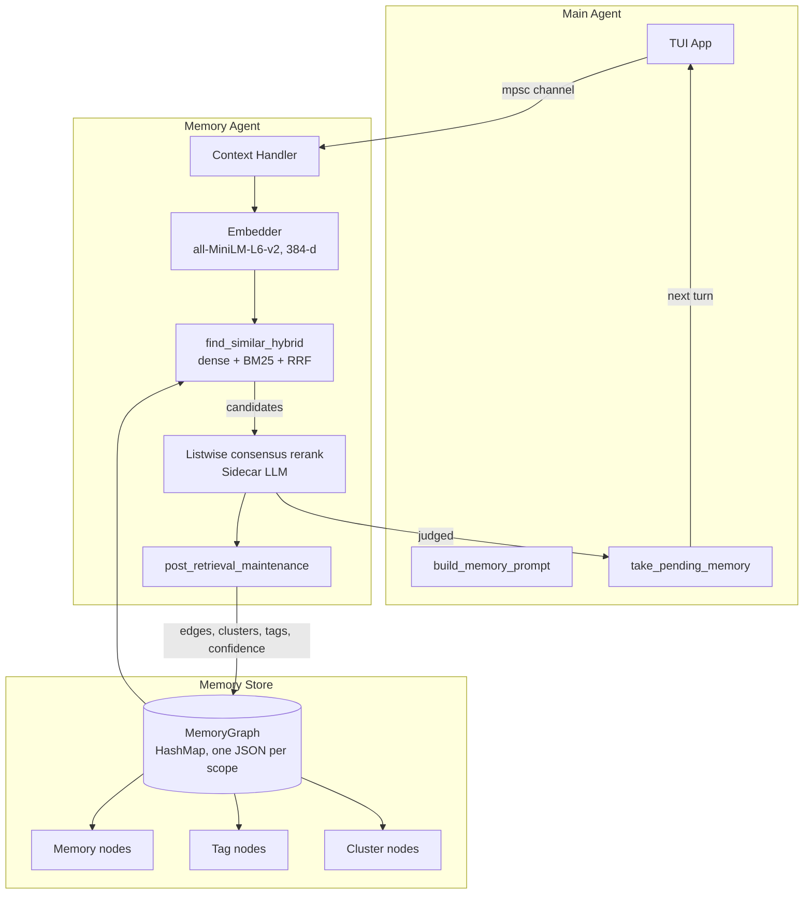
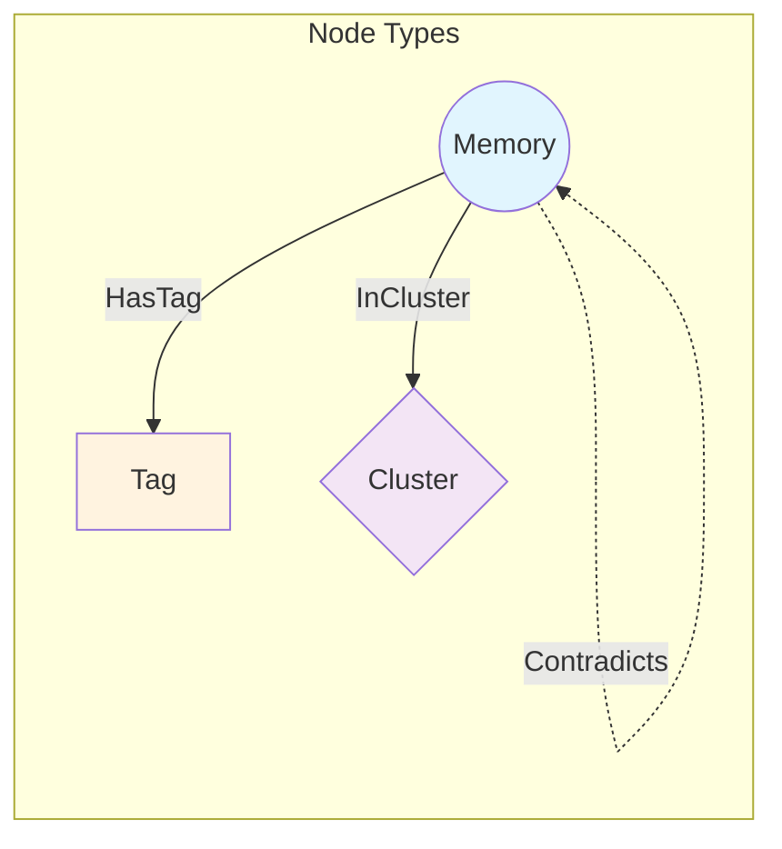
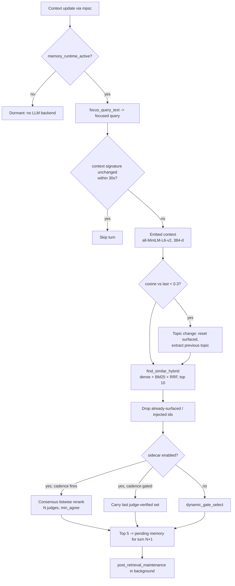
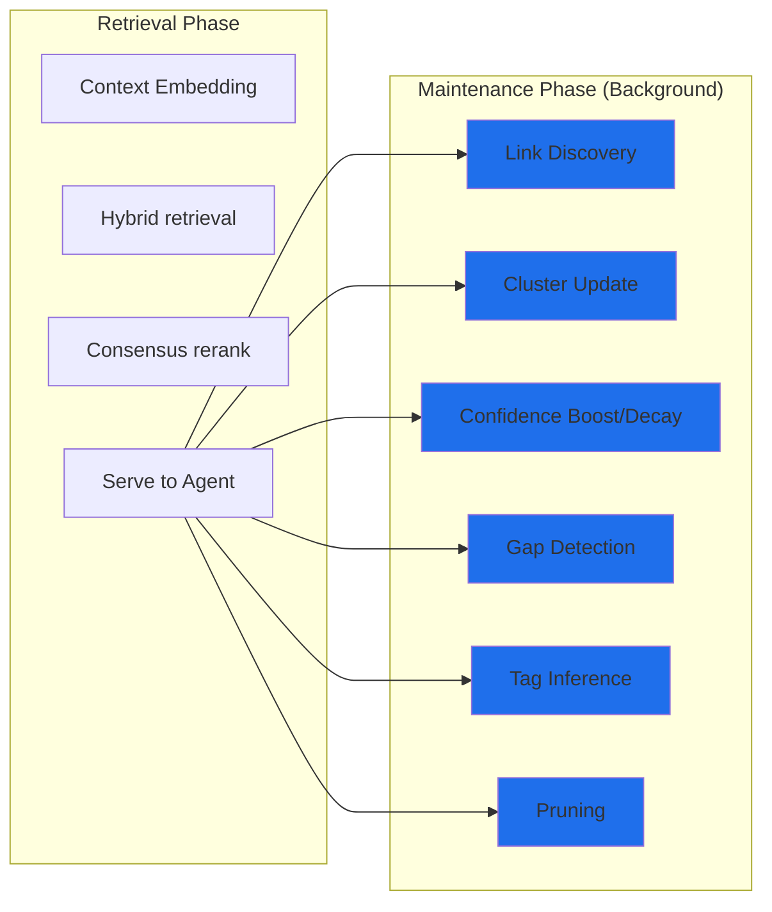
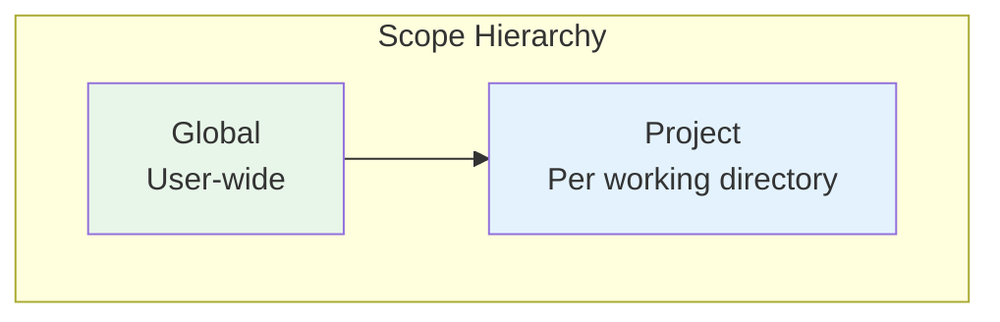
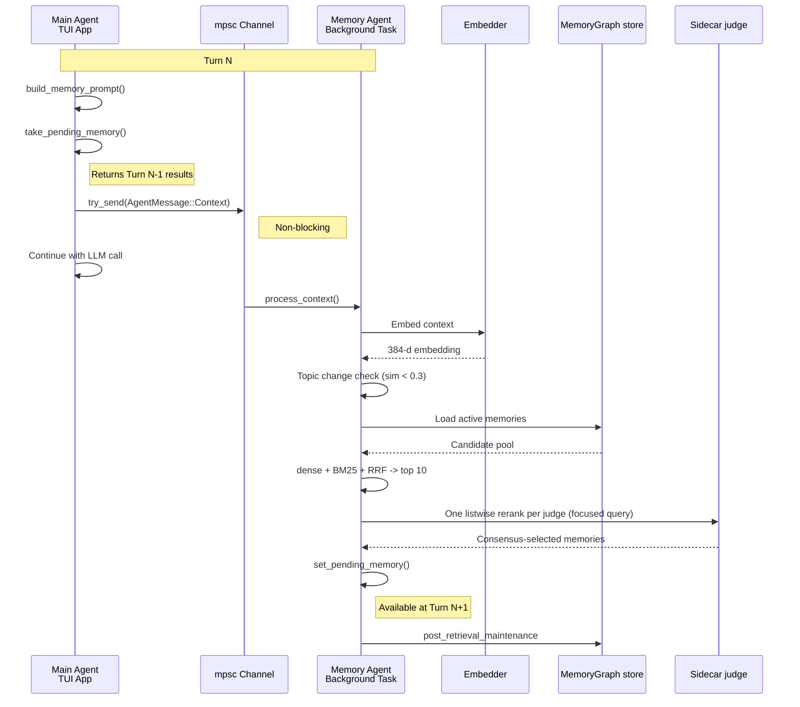

# Memory Architecture

> **Status:** Implemented — local embeddings + hybrid (dense + BM25 + RRF) retrieval + listwise consensus LLM rerank.
> The memory *graph* is written every turn but is **not read** by the live turn path; graph traversal
> (`cascade_retrieve`) is reachable only from the `memory` tool. Sections below are marked
> **Not implemented** where they describe designs that were never built.
> **Updated:** 2026-09-05

## Overview

See also: [Memory Regression Budget](./MEMORY_BUDGET.md) for the current measurable guardrails and review expectations.

A multi-layered memory system for cross-session learning that mimics how human memory works — relevant memories "pop up" when triggered by context rather than requiring explicit recall.

**Key design decisions (as built):**
1. **Fully async and non-blocking** — the main agent never waits for memory; results from turn N are available at turn N+1 (`memory_agent.rs:268` `try_send`, `memory_agent.rs:854` `set_pending_memory_*`).
2. **Hybrid first-stage retrieval** — dense cosine over embeddings fused with BM25 by Reciprocal Rank Fusion; no cosine floor (`memory.rs:642`, `memory.rs:668`).
3. **The LLM judge is the precision layer** — one listwise consensus rerank per fired turn decides what is injected (`memory_rerank.rs:249`).
4. **Graph organization is write-mostly** — tags, clusters and semantic edges are maintained after every retrieval (`memory_agent.rs:1200`), but the live turn path never traverses them.

---

## Architecture Overview



The dashed line that used to run from a graph BFS into the live path does not exist in the shipped
code: `find_similar_hybrid` reads the graph only as a flat pool of active memories
(`memory.rs:734` `collect_memories_with_embeddings_scoped`).

---

## Graph-Based Data Model

### Node Types



| Node Type | Description | Storage | Source |
|-----------|-------------|---------|--------|
| **Memory** | Core memory entry | `MemoryEntry` (content, category, tags, embedding, confidence, …) | `jcode-memory-types/src/lib.rs:233` |
| **Tag** | Explicit label, id `tag:{name}` | Name, optional description, count, `created_at` | `graph.rs:149` |
| **Cluster** | Co-relevance grouping, id `cluster:{id}` | Optional name, centroid, member count, timestamps | `graph.rs:183` |

Nodes are not stored in a graph library. Each scope is one `MemoryGraph` (`graph.rs:231`) made of plain
`HashMap`s — `memories`, `tags`, `clusters`, `edges` (`source_id -> Vec<Edge>`) and `reverse_edges`
(`target_id -> Vec<source_id>`), plus `GraphMetadata` (`graph.rs:217`) and a `graph_version`
(`GRAPH_VERSION = 2`, `graph.rs:16`). The `HashMap` layout was chosen for clean JSON serialization;
no third-party graph library is used anywhere in the workspace.

### Edge Types

| Edge Type | From → To | Description | BFS traversal weight |
|-----------|-----------|-------------|---------------------:|
| `HasTag` | Memory → Tag | Memory has this explicit tag | `0.8` |
| `InCluster` | Memory → Cluster | Memory belongs to an auto co-relevance cluster | `0.6` |
| `RelatesTo { weight }` | Memory → Memory | Semantic relationship (weight defaults to `1.0`) | `weight` |
| `Supersedes` | Memory → Memory | Newer memory replaces older | `0.9` |
| `Contradicts` | Memory → Memory | Conflicting information (both kept, flagged) | `0.3` |
| `DerivedFrom` | Memory → Memory | Procedural knowledge derived from facts | `0.7` |

`EdgeKind` is defined at `graph.rs:92`; the weights come from `EdgeKind::traversal_weight`
(`graph.rs:116`) and are used only by `cascade_retrieve`.

### Rust Implementation

```rust
// crates/jcode-memory-types/src/graph.rs:92
#[derive(Debug, Clone, Serialize, Deserialize, PartialEq)]
#[serde(tag = "kind", rename_all = "snake_case")]
pub enum EdgeKind {
    HasTag,
    InCluster,
    RelatesTo { #[serde(default = "default_weight")] weight: f32 },
    Supersedes,
    Contradicts,
    DerivedFrom,
}

// crates/jcode-memory-types/src/graph.rs:130
#[derive(Debug, Clone, Serialize, Deserialize)]
pub struct Edge {
    pub target: String,
    #[serde(flatten)]
    pub kind: EdgeKind,
}

/// The memory graph - HashMap-based for clean JSON serialization
// crates/jcode-memory-types/src/graph.rs:231
#[derive(Debug, Clone, Serialize, Deserialize)]
pub struct MemoryGraph {
    pub graph_version: u32,
    pub memories: HashMap<String, MemoryEntry>,
    pub tags: HashMap<String, TagEntry>,
    #[serde(default)]
    pub clusters: HashMap<String, ClusterEntry>,
    /// Forward edges: source_id -> Vec<Edge>
    #[serde(default)]
    pub edges: HashMap<String, Vec<Edge>>,
    /// Reverse edges for efficient BFS: target_id -> Vec<source_id>
    #[serde(default, skip_serializing_if = "HashMap::is_empty")]
    pub reverse_edges: HashMap<String, Vec<String>>,
    #[serde(default)]
    pub metadata: GraphMetadata,
}
```

---

## Hybrid Grouping System

The memory system organizes memories three ways. All three are *written*; only tags participate in
retrieval, and then only lexically (tags are folded into the BM25 search text via
`normalize_memory_search_text`, `jcode-memory-types/src/lib.rs:814`).

### 1. Tags (Explicit)

**Sources:**
- User/agent explicitly tags: `memory { action: "remember", tags: ["rust", "auth"] }` (`tool/memory.rs:118`)
- Inferred during maintenance from the shared retrieval context (`infer_context_tag`, `memory_agent.rs:1278`)
- Extracted by the sidecar during incremental/final extraction

Tag nodes are created on demand (`ensure_tag`) with id `tag:{name}` and a member `count`
(`graph.rs:164`).

### 2. Clusters (Automatic co-relevance)

**Algorithm as built** (`refine_clusters`, `memory_agent.rs:1326`):
1. Every `CLUSTER_REFINEMENT_INTERVAL = 50` maintenance ticks (`memory_agent.rs:95`), if ≥2 memories were
   judged relevant this turn.
2. A deterministic cluster id `auto-{scope}-{hash-of-member-ids}` is created or updated
   (`memory_agent.rs:1440`).
3. Centroid = mean of member embeddings (`average_embedding`, `memory_agent.rs:1442`); `InCluster`
   edges are added for each member (`memory_agent.rs:1465`).
4. The cluster is named by the sidecar LLM, falling back to `infer_candidate_tag` when the sidecar is
   off (`name_cluster_with_sidecar`, `memory_agent.rs:1400`).

**Not implemented:** density-based clustering (HDBSCAN/k-means) over the whole embedding set. Clusters
are co-retrieval sets, not discovered dense regions, and centroids are never queried.

### 3. Links (Semantic Relationships)

- **RelatesTo**: created between every pair of co-relevant memories after a turn, at a fixed
  `LINK_WEIGHT = 0.6` (`discover_links`, `memory_agent.rs:1682`). Cross-scope pairs are rejected
  (`link_memories`, `memory.rs:1818`).
- **Supersedes / Contradicts**: written by write-time dedup/contradiction handling and by legacy
  migration (`graph.rs:651`, `mark_contradiction` `graph.rs:521`).
- **DerivedFrom**: defined in the schema; no writer in the current code.

---

## Cascade Retrieval (tool-only)

`cascade_retrieve` is a BFS over the graph. It is **not** part of the live turn path. The only entry
points are:

- `memory { action: "recall", query: "..." }` — `mode` defaults to `"cascade"` whenever a query is
  present (`tool/memory.rs:185-191`), so this is the ordinary tool recall path — via
  `MemoryManager::find_similar_with_cascade_scoped` (`tool/memory.rs:236`, `memory.rs:1882`).
- `memory { action: "related", id: "..." }` via `MemoryManager::get_related`
  (`tool/memory.rs:411`, `memory.rs:1840`).

```mermaid
sequenceDiagram
    participant T as memory tool
    participant E as Embedder
    participant S as find_similar_scoped
    participant G as MemoryGraph BFS
    participant R as Results

    T->>E: query text
    E->>S: query embedding
    S->>S: cosine >= 0.5, top-N
    S->>G: seed ids + scores

    loop BFS to max_depth (2 from the tool)
        G->>G: follow edges; tag targets fan out to tagged memories
        G->>G: score = seed_score * edge_weight * 0.7^(depth+1)
    end

    G->>R: top-k by score
```

### Algorithm

```rust
// crates/jcode-memory-types/src/graph.rs:546
pub fn cascade_retrieve(
    &mut self,
    seed_ids: &[String],
    seed_scores: &[f32],
    max_depth: usize,
    max_results: usize,
) -> Vec<(String, f32)>
```

- Seeds are the embedding hits; `metadata.retrieval_count` is incremented (`graph.rs:553`).
- Each hop multiplies by `EdgeKind::traversal_weight` and a depth decay of `0.7^(depth+1)`
  (`graph.rs:588-590`).
- A `tag:` target is expanded through `reverse_edges` to every memory carrying that tag
  (`graph.rs:593-604`).
- Results are keyed by memory id, keeping the best score, then truncated by a top-k heap
  (`graph.rs:617`).

### Retrieval Parameters (as called)

| Parameter | Value | Where |
|-----------|-------|-------|
| Seed cosine threshold | `0.5` | `tool/memory.rs:236` (tool passes it) |
| `max_depth` | `2` | `memory.rs:1915` / `1921` |
| `max_results` | `limit * 2` per scope, merged then truncated to `limit` | `memory.rs:1915`, `memory.rs:1944` |
| Edge decay | `0.7` per hop | `graph.rs:589` |
| `get_related` results | `20`, depth from the tool call | `memory.rs:1857` |

---

## Live Retrieval Pipeline (the shipped per-turn path)

This is what actually runs on every turn. Entry point: `memory_agent::process_context`
(`memory_agent.rs:477`).



### Stage 0 — Gating and query construction

- If sidecar mode is requested but no LLM backend is reachable, the runtime goes **dormant** for the
  turn rather than degrading to the no-LLM path: `memory_agent.rs:493` checks
  `memory::memory_runtime_active` (`memory.rs:144`), which returns `true` either when the user
  explicitly opted out of the sidecar or when `Sidecar::llm_backend_available` (`sidecar.rs:224`) is
  true.
- The **focused query** used for reranking is built by `format_focused_query_for_relevance`
  (`memory_prompt.rs:156`) → `focus_query_text` (`memory_prompt.rs:163`): it strips
  `<system-reminder>` blocks, drops `[Tool: …]` / `[Result: …]` / `[Image]` lines, keeps prose, and
  places the most recent user message first. The unfocused blob
  (`format_context_for_relevance`, `memory_prompt.rs:117`) is still what gets embedded.
- Repeated identical contexts are suppressed for `RELEVANCE_CONTEXT_REPEAT_SUPPRESSION_SECS = 30`
  (`memory_agent.rs:296`, checked at `memory_agent.rs:520`).

### Stage 1 — Embedding

- Backend-dispatched via `embedding_backend::embed_query_active` on a blocking task
  (`memory_agent.rs:548`).
- Default backend is the bundled local ONNX model: `MODEL_NAME = "all-MiniLM-L6-v2"`
  (`jcode-embedding/src/lib.rs:10`), `EMBEDDING_DIM = 384`, `MAX_SEQ_LENGTH = 256`
  (`jcode-embedding/src/lib.rs:85-86`). An opt-in remote OpenAI backend is selectable via
  `agents.memory_embedding_backend` (`jcode-config-types/src/lib.rs:580`).
- Topic change fires below `TOPIC_CHANGE_THRESHOLD = 0.3` cosine against the previous turn
  (`memory_agent.rs:42`, `memory_agent.rs:582`), which clears `surfaced_memories` and triggers
  extraction of the previous topic when at least `MIN_TURNS_FOR_EXTRACTION = 4` turns have passed
  (`memory_agent.rs:289`). Independently, extraction runs every
  `PERIODIC_EXTRACTION_INTERVAL = 12` turns (`memory_agent.rs:293`, `memory_agent.rs:636`).

### Stage 2 — Hybrid candidate generation

`MemoryManager::find_similar_hybrid` (`memory.rs:642`) → `hybrid_fuse` (`memory.rs:668`), called with
`EMBEDDING_MAX_HITS = 10` (`memory.rs:1982`, call site `memory_agent.rs:657`):

- Pool per retriever: `max(limit * 5, HYBRID_POOL_MIN)` where `HYBRID_POOL_MIN = 50`
  (`memory.rs:683`, `memory.rs:1985`).
- **Dense half:** batch cosine over embeddings, **no cosine floor**. Only entries whose
  `effective_embedding_model()` equals the active backend's model participate, so a backend switch
  cannot mix vector spaces (`memory.rs:691-706`).
- **Sparse half:** `bm25_rank` (`memory.rs:1991`) over each memory's normalized search text
  (content + tags), with `K1 = 1.2` and `B = 0.75` (`memory.rs:1992-1993`). Memories with zero query
  term overlap are dropped. Entries excluded from the dense half by the vector-space gate remain
  reachable here.
- **Fusion:** Reciprocal Rank Fusion with `RRF_K = 60.0`, score `1 / (RRF_K + rank + 1)` summed across
  both rankings (`memory.rs:712-719`).
- The candidate pool is the **active** memories of the in-scope graphs that have an embedding
  (`memory.rs:734`).

Already-surfaced (per session) and already-injected ids are then filtered out
(`memory_agent.rs:676-685`).

The mode gate is `agents.memory_sidecar_enabled`, env `JCODE_MEMORY_SIDECAR_ENABLED`
(`jcode-config-types/src/lib.rs:555`, `crates/jcode-base/src/config/env_overrides.rs:385`). It
**defaults to `true`** (`default_memory_sidecar_enabled`, `jcode-config-types/src/lib.rs:612`), so
Mode 2 is the shipped default and Mode 1 is an explicit opt-out.

### Stage 3a — Mode 2 (sidecar on, the default): listwise consensus rerank

- **Cadence gate:** `should_run_rerank` (`memory_agent.rs:314`, called at `memory_agent.rs:719`) fires
  at most once every `agents.memory_rerank_cadence` turns (default `3`,
  `jcode-config-types/src/lib.rs:561`, `:616`). A topic change or the first rerank of a session always
  fires.
- **Consensus judge:** `memory_rerank::rerank_candidates_consensus_attributed`
  (`memory_rerank.rs:249`) runs `agents.memory_rerank_votes` independent listwise reranks
  concurrently over the same prompt and keeps only memories selected by at least
  `agents.memory_rerank_min_agree` of them. Defaults are `votes = 2`, `min_agree = 2`
  (`jcode-config-types/src/lib.rs:568-573`, `:620-626`); `min_agree` is clamped to `1..=votes`
  (`memory_agent.rs:729`). The prompt is built from the **focused query**, not the raw window.
- **Failure policy:** any judge failure returns an empty set (`RerankOutcome`,
  `memory_rerank.rs:208`); the caller then carries the last judge-verified set rather than injecting
  unvetted hybrid order (`carry_verified`, `memory_agent.rs:909`, used at `memory_agent.rs:768` and
  `:793`). A circuit breaker suppresses cross-session retry storms
  (`failure_backoff_active`, `memory_rerank.rs:256`). Outcomes are attributed in
  `memory_judge_metrics` (`memory_agent.rs:748`).
- Surfaced set is capped at `MAX_MEMORIES_PER_TURN = 5` (`memory_agent.rs:45`).

### Stage 3b — Mode 1 (sidecar explicitly off): dynamic gate

`select_top_candidates_no_sidecar` (`memory_agent.rs:886`) → `dynamic_gate_select`
(`memory_agent.rs:71`): walks the hybrid-ranked candidates in order and stops at the first score gap,
keeping a candidate only while its score stays within `GATE_REL_FLOOR = 0.90` of the top score **and**
within `GATE_DROP_RATIO = 0.95` of the previously kept score (`memory_agent.rs:61-62`,
`memory_agent.rs:82`). This yields a variable `1..=5` memories instead of a padded top-5.

Extraction is skipped entirely in Mode 1 — `extract_from_context` requires a live sidecar
(`memory_agent.rs:935`), so memories are only created through the explicit `memory` tool.

### Stage 4 — Handoff

`set_pending_memory_with_ids_and_display` (`memory_agent.rs:854`) stores the formatted prompt for the
main agent to pick up on the next turn; `format_relevant_prompt` /
`format_relevant_display_prompt` do the rendering (`jcode-memory-types/src/lib.rs:656`, `:660`).

---

## Memory Entry Schema

```rust
// crates/jcode-memory-types/src/lib.rs:233
#[derive(Debug, Clone, Serialize, Deserialize)]
pub struct MemoryEntry {
    pub id: String,                          // "mem_{millis}_{rand}"
    pub category: MemoryCategory,
    pub content: String,
    pub tags: Vec<String>,
    /// Pre-normalized lowercase search text for content + tags (BM25 input).
    #[serde(default, skip_serializing_if = "String::is_empty")]
    pub search_text: String,
    pub created_at: DateTime<Utc>,
    pub updated_at: DateTime<Utc>,
    pub access_count: u32,
    pub source: Option<String>,
    #[serde(default)]
    pub trust: TrustLevel,
    /// Consolidation strength (how many times this was reinforced)
    #[serde(default)]
    pub strength: u32,
    #[serde(default = "default_active")]
    pub active: bool,
    #[serde(default, skip_serializing_if = "Option::is_none")]
    pub superseded_by: Option<String>,
    /// Breadcrumbs of when/where this was reinforced
    #[serde(default)]
    pub reinforcements: Vec<Reinforcement>,
    #[serde(default, skip_serializing_if = "Option::is_none")]
    pub embedding: Option<Vec<f32>>,
    /// e.g. "minilm-l6-v2" or "openai:text-embedding-3-small"; None = legacy MiniLM
    #[serde(default, skip_serializing_if = "Option::is_none")]
    pub embedding_model: Option<String>,
    #[serde(default = "default_confidence")]
    pub confidence: f32,
}

// crates/jcode-memory-types/src/lib.rs:465
#[derive(Debug, Clone, Serialize, Deserialize, PartialEq, Eq, Hash)]
#[serde(rename_all = "lowercase")]
pub enum MemoryCategory { Fact, Preference, Entity, Correction, Custom(String) }

// crates/jcode-memory-types/src/lib.rs:213 — source trust, not a provenance chain
#[derive(Debug, Clone, Copy, Serialize, Deserialize, PartialEq, Default)]
#[serde(rename_all = "lowercase")]
pub enum TrustLevel { High, #[default] Medium, Low }

// crates/jcode-memory-types/src/lib.rs:225
#[derive(Debug, Clone, Serialize, Deserialize)]
pub struct Reinforcement {
    pub session_id: String,
    pub message_index: usize,
    pub timestamp: DateTime<Utc>,
}

// crates/jcode-memory-types/src/lib.rs:518 — a query filter, not a per-entry field
#[derive(Debug, Clone, Copy, PartialEq, Eq)]
pub enum MemoryScope { Project, Global, All }
```

Notes on things the schema does **not** have: there is no `MemoryType` enum (category and
`TrustLevel` carry that information), no `Provenance` enum, no `message_range`, no `file_paths`,
no `trust_score`, no `last_accessed`, and no per-entry `scope` field — scope is determined by which
file the entry lives in. `LEGACY_EMBEDDING_MODEL = "minilm-l6-v2"` labels entries written before
embedding-model tagging existed (`jcode-memory-types/src/lib.rs:278`).

---

## Advanced Features

### 1. Confidence Decay (implemented)

`MemoryEntry::effective_confidence` (`jcode-memory-types/src/lib.rs:352`) applies exponential decay by
**category** and a mild access boost:

| Category | Half-life |
|----------|----------:|
| Correction | 365 days |
| Preference | 90 days |
| Entity | 60 days |
| Custom(_) | 45 days |
| Fact | 30 days |

```
effective = min(1.0, confidence * exp(-age_days / half_life * 0.693)
                              * (1.0 + 0.1 * ln(access_count + 1)))
```

`boost_confidence` (`:371`) adds to confidence and increments `access_count`; `decay_confidence`
(`:378`) subtracts, floored at 0.

### 2. Feedback Loops (implemented)

After each turn, verified memories are boosted and rejected candidates decayed in a single batched
graph load/save per scope (`apply_confidence_updates`, `memory_agent.rs:1241`).

### 3. Reinforcement Provenance (implemented)

`MemoryEntry::reinforcements` records `(session_id, message_index, timestamp)` breadcrumbs each time a
memory is reinforced instead of duplicated.

### 4. Weak-memory pruning (implemented)

`prune_low_confidence` (`memory_agent.rs:1479`) runs every `CLUSTER_REFINEMENT_INTERVAL * 5` = 250
maintenance ticks (`memory_agent.rs:1291`) and drops memories below `confidence 0.15` that are older
than 24 hours.

### 5. Negative memories and trigger patterns — **Not implemented**

There is no `Negative` category and no `trigger_patterns` field; nothing matches memories against
patterns in the current context.

### 6. Procedural memories — **Not implemented**

There is no `Procedure` type with steps/prerequisites/warnings. Procedural knowledge is stored as
ordinary `Fact`/`Correction` content, and the `DerivedFrom` edge has no writer.

### 7. Temporal awareness — **Not implemented**

There is no `TemporalContext`, no recency-weight boost in the ranking, and no session-scoped memory
type. The only time-based signal is the confidence half-life above.

### 8. Post-Retrieval Maintenance (implemented)

After serving memories the agent runs maintenance in a detached task
(`post_retrieval_maintenance`, `memory_agent.rs:1200`).



**Available context** (`RetrievalContext`, populated at `memory_agent.rs:822`): the verified ids, the
rejected ids, and a 200-char context snippet. The context embedding itself is *not* handed to
maintenance.

| Task | Trigger | Action | Source |
|------|---------|--------|--------|
| **Link discovery** | ≥2 verified | `RelatesTo` edge for every pair, weight `0.6` | `memory_agent.rs:1222`, `:1682` |
| **Confidence boost/decay** | every turn | boost verified, decay rejected, one load/save per scope | `memory_agent.rs:1240` |
| **Gap detection** | verified empty and rejected non-empty | log a memory gap event | `memory_agent.rs:1247` |
| **Cluster refinement** | every 50 ticks and ≥2 verified | co-relevance cluster + centroid + `InCluster` edges + LLM name | `memory_agent.rs:1259`, `:1326` |
| **Tag inference** | ≥2 verified | infer a shared tag from the context snippet | `memory_agent.rs:1277` |
| **Pruning** | every 250 ticks | drop confidence <0.15, age >24h | `memory_agent.rs:1291` |

Gap detection only emits an event and a log line — there is no persisted `MemoryGap` record and no
later replay of gaps into extraction.

### 9. Scope Levels



| Scope | Storage | Lifetime |
|-------|---------|----------|
| Global | `~/.jcode/memory/global.json` | Permanent |
| Project | `~/.jcode/memory/projects/<hash>.json` | Until deleted |

`MemoryScope::All` (`jcode-memory-types/src/lib.rs:518`) is the query-side union, and it is what the
live path uses. There is **no** persisted session scope.

---

## Async Processing Pipeline



**Key points:**
- The memory agent is a **singleton** (`tokio::sync::OnceCell`, `memory_agent.rs:98`).
- Communication is **non-blocking** via `try_send()` on an mpsc channel (`memory_agent.rs:268`);
  the protocol is just `AgentMessage::Context { .. }` and `AgentMessage::Reset` (`memory_agent.rs:278`).
- Results arrive **one turn behind**.
- **Topic change detection** clears the per-session surfaced set; injected-memory ids are
  deliberately *not* cleared and age out via TTL instead (`memory_agent.rs:613-621`).

---

## Storage Layout

One JSON file per scope. The whole `MemoryGraph` — memories, tags, clusters and edges — is serialized
into that single file; there are no separate embedding, cluster or tag files, and embeddings live
inline on each entry.

```
~/.jcode/memory/
├── projects/
│   └── <project_hash>.json       # MemoryGraph for one working directory
│   └── <project_hash>.json.bak   # one-time backup written on legacy migration
├── global.json                   # MemoryGraph for user-wide memories
└── test/                         # only when the manager is in test mode
    ├── test_project.json
    └── test_global.json
```

- `project_memory_path` (`memory.rs:252`): `<jcode_dir>/memory/projects/{hash}.json`, where the hash is
  a 16-hex `DefaultHasher` digest of the working directory path (`memory.rs:265-274`).
- `global_memory_path` (`memory.rs:354`): `<jcode_dir>/memory/global.json`.
- Load path (`load_project_graph`, `memory.rs:1658`; `load_global_graph`, `memory.rs:1723`) tries
  `MemoryGraph` first, and falls back to the legacy flat `MemoryStore` shape, migrating via
  `MemoryGraph::from_legacy_store` (`graph.rs:625`) after copying a `.json.bak` (`memory.rs:1696`).
- Legacy `remember` notes at `<jcode_dir>/notes/{hash}.json` are imported once into the project graph
  (`legacy_notes_path`, `memory.rs:277`; `import_legacy_notes_into_graph`, `memory.rs:316`).
- Loaded graphs are memoized in a process cache (`cached_graph` / `cache_graph`) outside test mode.

---

## The Memory Sidecar

`Sidecar` (`crates/jcode-base/src/sidecar.rs`) is the lightweight LLM client used for reranking,
extraction, dedup/contradiction checks and cluster naming.

Model selection (`Sidecar::new` → `with_configured_model` → `auto_select_backend`,
`sidecar.rs:154-211`):

1. `agents.memory_model` override, routed by `provider_for_model` to the OpenAI or Claude backend; an
   unroutable value logs a warning and falls through to auto-selection (`sidecar.rs:160-174`).
2. Codex credentials present → OpenAI `SIDECAR_OPENAI_MODEL = "gpt-5.6-luna"` at
   `reasoning = "none"` (`sidecar.rs:17-18`). On an OAuth account without access to that model the
   request falls back to `SIDECAR_OPENAI_OAUTH_FALLBACK_MODEL = "gpt-5.4"` at `reasoning = "low"`
   (`sidecar.rs:19-20`, resolved in `resolve_openai_request_model`, `sidecar.rs:765-777`), and then to
   Claude if that also fails (`sidecar.rs:392-398`).
3. Claude credentials present → `SIDECAR_CLAUDE_MODEL = "claude-haiku-4-5-20251001"` (`sidecar.rs:23`).
4. Otherwise dispatch through whatever provider the agent is already running on
   (`SidecarBackend::Provider`, `sidecar.rs:201-205`).
5. No credentials and no provider → Claude, so the eventual error is actionable
   (`sidecar.rs:206-209`).

`Sidecar::llm_backend_available` (`sidecar.rs:224`) is re-evaluated live and is what makes memory go
dormant instead of silently degrading when a login is lost. Sidecar responses are capped at
`DEFAULT_MAX_TOKENS = 1024` (`sidecar.rs:48`).

---

## Memory Tools

Available to the main agent. The advertised parameter schema
(`crates/jcode-app-core/src/tool/memory.rs:101`) is deliberately narrow: `action`, `content`,
`category`, `query`, `id`, `tags`, `scope`, `from_id`, `to_id`, `limit`. `mode`, `depth` and `weight`
are accepted by the deserializer but intentionally **not** advertised (regression-pinned by
`schema_only_advertises_core_memory_fields`, `tool/memory.rs:465`), so callers get the defaults.

```
memory { action: "remember", content: "...", category: "fact|preference|entity|correction",
         scope: "project|global", tags: ["tag1", "tag2"] }
memory { action: "recall", limit: 10 }                # recent memories (no query -> mode "recent")
memory { action: "recall", query: "..." }             # mode defaults to "cascade": cosine >= 0.5 seeds + graph BFS
memory { action: "search", query: "..." }             # normalized substring search
memory { action: "list", scope: "project" }           # list every memory in scope
memory { action: "forget", id: "..." }                # deactivate memory
memory { action: "tag", id: "...", tags: ["new", "tags"] }
memory { action: "link", from_id: "id1", to_id: "id2" }   # RelatesTo, default weight 0.5
memory { action: "related", id: "..." }               # graph neighbors, default depth 2
```

Handlers: `remember` `:138`, `recall` `:182`, `search` `:283`, `list` `:311`, `forget` `:333`,
`tag` `:348`, `link` `:375` (weight default `0.5`, `:382`), `related` `:403` (depth default `2`,
`:405`). `list` ignores `tags` — it returns everything in scope (`:317`).

CLI surface (`src/cli/args.rs:961`): `jcode memory list|search|export|import|stats|clear-test`. There
is no `jcode memory remember`/`forget` — writes go through the tool.

---

## Implementation Status

### Phase 1: Basic Memory Tools — done
- [x] Memory store with file persistence
- [x] `memory` tool
- [x] Integration with the agent

### Phase 2: Embedding Search — done
- [x] Local all-MiniLM-L6-v2 (384-d) via tract-onnx
- [x] Background embedding
- [x] Cosine similarity search
- [x] Opt-in remote OpenAI embedding backend (`embedding_backend.rs`)

### Phase 3: Memory Agent — done
- [x] Async channel communication
- [x] Sidecar for relevance/extraction (`gpt-5.6-luna`, Claude haiku, or the live provider)
- [x] Topic change detection
- [x] Surfaced/injected memory tracking
- [x] Dormancy when sidecar mode is on but no LLM backend is reachable

### Phase 4: Graph Structure — done (write path only)
- [x] `HashMap`-based graph, one JSON per scope
- [x] Tag nodes and `HasTag` edges
- [x] Co-relevance clusters and `InCluster` edges
- [x] `RelatesTo` / `Supersedes` / `Contradicts` edges
- [x] `cascade_retrieve` BFS
- [ ] **Graph structure read back by the live turn path** (tool-only today)

### Phase 5: Post-Retrieval Maintenance — done
- [x] Link discovery, confidence boost/decay, gap events, cluster refinement, tag inference, pruning

### Phase 6: Advanced Features — partial
- [x] Category-based confidence decay
- [x] Feedback loops (boost on use, decay on rejection)
- [x] Reinforcement breadcrumbs
- [ ] Negative memories and trigger patterns
- [ ] Procedural memory support
- [ ] Temporal awareness

### Phase 7: Integration — done
- [x] End-of-session extraction (`trigger_final_extraction_with_dir`, `memory_agent.rs:1853`;
      invoked from the TUI and server session-teardown paths, e.g.
      `crates/jcode-tui/src/tui/app/conversation_state.rs:526`)
- [x] Incremental extraction on topic change and every 12 turns
- [x] Write-time dedup (`STORAGE_DEDUP_THRESHOLD = 0.85`, `memory.rs:394`) and contradiction handling
- [x] `jcode memory` CLI
- [x] Export/import

### Phase 8: Hybrid + Rerank Retrieval — done
- [x] `find_similar_hybrid`: dense + BM25 + RRF, no cosine floor
- [x] Vector-space gate on the dense half so backend switches do not mix embedding spaces
- [x] Focused-query listwise LLM rerank
- [x] Multi-judge consensus voting, cadence gating, verified-set carry, circuit breaker
- [x] Judge outcome attribution (`memory_judge_metrics`)

### Phase 9: Deep Memory Consolidation — not started
See [AMBIENT_MODE.md](./AMBIENT_MODE.md) for the ambient background-cycle design that would host it.

- [ ] Graph-wide similarity-based merging
- [ ] Redundancy detection beyond the retrieved set
- [ ] Contradiction resolution across the full graph
- [ ] Fact verification against the codebase
- [ ] Retroactive extraction for crashed/missed sessions
- [ ] Cluster reorganization
- [ ] Relationship discovery across sessions
- [ ] Embedding backfill for entries missing embeddings

---

## Privacy & Security

### User control (implemented)
- All memories are stored as human-readable JSON under `~/.jcode/memory/`.
- `jcode memory list|search|stats|export|import` for inspection and backup.
- `agents.memory_sidecar_enabled = false` disables all LLM memory work (extraction stops entirely, so
  nothing is auto-learned).

### Content filtering — **Not implemented**

There is no secret scanner in the memory path: no regex secret detection, no `.gitignore`/
`.secretsignore` check, and no `.env` exclusion before a memory is written. Nothing prevents the
extraction sidecar from storing a credential it saw in the transcript. Treat
`~/.jcode/memory/*.json` as potentially sensitive, and prefer disabling extraction on repositories
where transcripts routinely carry secrets.

---

## Open Questions

1. **Making the graph earn its keep:** which edges, if any, should the live path read? See
   [plans/MEMORY_GRAPH_PLAN.md](./plans/MEMORY_GRAPH_PLAN.md).
2. **Multi-machine sync:** should memories sync across devices via encrypted backup?
3. **Team sharing:** should some memories be shareable across a team?
4. **Persistence:** JSON is rewritten wholesale per scope on every maintenance write; at what graph
   size does that need SQLite?
5. **Secret hygiene:** what is the right pre-write filter, given extraction is LLM-driven?

---

*Last updated: 2026-09-05*
