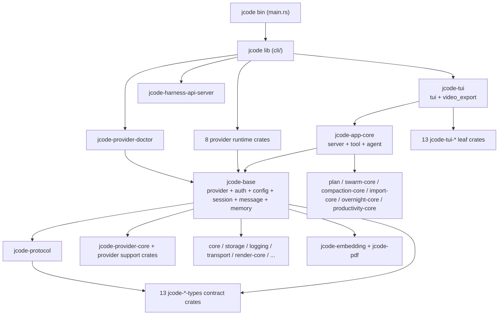
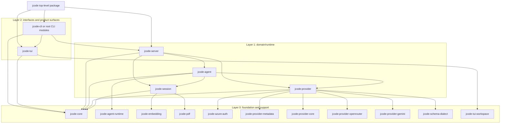

# Modular Architecture RFC

Status: **Partly realized — read the target sections as unbuilt.** The layered
target this RFC names (`jcode-server`, `jcode-agent`, `jcode-session`,
`jcode-provider`, `jcode-cli`) does **not** exist in the workspace. What landed
instead is a four-crate vertical spine — `jcode` (cli + bin) -> `jcode-tui` ->
`jcode-app-core` -> `jcode-base` — plus 72 leaf crates
(`Cargo.toml:9-87`). Of the ten dependency rules below, exactly one slice is
machine-enforced: `*-types` crates may not depend on the runtime/UI crates in
`FORBIDDEN_INTERNAL_DEPS` (`scripts/check_dependency_boundaries.py:28-47`), gated
at `scripts/check_guardrails.sh:89`. Everything else here is advisory.

This RFC describes a modular target architecture for jcode. It was written while
the product was still one monolithic root crate; the "Current Architecture"
section has since been rewritten against the post-split workspace, while the
target sections are kept as the intended direction rather than a description of
what exists.

It is intentionally aligned with:

- [`REFACTORING.md`](./REFACTORING.md)
- [`COMPILE_PERFORMANCE_PLAN.md`](./plans/COMPILE_PERFORMANCE_PLAN.md)
- [`SERVER_ARCHITECTURE.md`](./SERVER_ARCHITECTURE.md)
- [`MULTI_SESSION_CLIENT_ARCHITECTURE.md`](./plans/MULTI_SESSION_CLIENT_ARCHITECTURE.md)

## Goals

- Document the architecture that exists today, not an idealized version.
- Define a target layered and crate architecture that improves maintainability and compile times.
- Establish dependency rules that prevent the workspace from collapsing back into a monolith.
- Provide a phased migration plan that fits the refactoring roadmap and compile-performance plan.
- Preserve runtime behavior: one shared server, reconnecting clients, and stable tool/provider flows.

## Non-Goals

- A big-bang rewrite.
- Renaming every module or crate immediately.
- Forcing every subsystem into a separate crate before its boundaries are ready.
- Changing the core product architecture from single-server, multi-client.

## Executive Summary

Today, jcode is best described as a **four-crate vertical spine with a wide skirt
of leaf crates**:

- The monolithic root crate was physically split into `jcode-base` ->
  `jcode-app-core` -> `jcode-tui` -> `jcode` (cli + bin). The root package now
  holds only `main.rs`, `lib.rs`, `cli/`, and `bin/`.
- Those spine crates are large and strictly serial, and each one glob-re-exports
  the layer below it (`crates/jcode-app-core/src/lib.rs:24`,
  `crates/jcode-tui/src/lib.rs:23`, `src/lib.rs:22`), so old `crate::<module>`
  paths still resolve and the real dependency direction stays invisible at import
  sites.
- 72 further crates hang off that spine — data contracts, provider support and
  runtime leaves, TUI leaves — and mostly compile in parallel below `jcode-base`.

So the monolith moved rather than dissolved: the compile bottleneck is now three
very large crates in a line instead of one very large crate.

The target architecture is a **layered workspace**:

1. **Foundation layer** for stable shared types and runtime primitives.
2. **Domain/runtime layer** for session, agent, provider, and server logic.
3. **Interface layer** for CLI, TUI, and optional heavy integrations.
4. **Composition layer** where the top-level `jcode` package wires the product together.

The most important design rule is this:

> High-churn orchestration code must depend on stable lower layers, while stable lower layers must never depend back on runtime/UI/product-specific code.

That rule serves both architecture quality and compile-speed goals.

## Current Architecture

### Current runtime model

At the product level, the runtime architecture is already clear:

- `jcode` is a **single-server, multi-client** application.
- The server owns sessions, swarm state, background tasks, provider state, and shared services.
- Clients are primarily TUI frontends that attach to server-owned sessions.

That model should stay intact.

### Current code organization

The organization is now **crate-first, not module-first**. The A/B/C split
recorded in [`plans/COMPILE_PERFORMANCE_PLAN.md`](./plans/COMPILE_PERFORMANCE_PLAN.md)
moved every root module into a crate, so the "root crate owns the product"
description that this RFC opened with no longer applies:

- The root package `jcode` is a thin cli + entrypoint shell. `src/` holds only
  `main.rs`, `lib.rs`, `cli/`, and `bin/` — nothing else.
- The three crates that inherited the monolith form a strictly serial spine:
  - `jcode-base` — provider, auth, config, session, message, memory and their
    supporting leaves (`crates/jcode-base/src/lib.rs:1-7`)
  - `jcode-app-core` — the server/tool/agent layer and its presentation-adjacent
    leaves (`crates/jcode-app-core/src/lib.rs:12-20`)
  - `jcode-tui` — terminal UI and offline replay export
    (`crates/jcode-tui/src/lib.rs:9-18`)
- Old `crate::<module>` paths still resolve because each layer glob-re-exports
  the one below it:
  - `crates/jcode-app-core/src/lib.rs:24` — `pub use jcode_base::*;`
  - `crates/jcode-tui/src/lib.rs:23` — `pub use jcode_app_core::*;`
  - `src/lib.rs:22` — `pub use jcode_tui::*;`

  That ladder is why dependency direction is still invisible at import sites. It
  is tracked as debt by the wildcard re-export ratchet
  (`scripts/wildcard_reexport_budget.json`, gated at
  `scripts/check_guardrails.sh:90`), which currently baselines 17 whole-crate
  globs across 17 files.

### Workspace inventory

76 crates plus the root package, from `[workspace] members` (`Cargo.toml:9-87`).

**Root package**

- `jcode` — cli parsing/dispatch, startup, and the shipped binaries
  (`Cargo.toml:89-123`)

**Application spine** (one large rustc unit each, compiled in series)

- `jcode-base` — foundational layer: provider, auth, config, session, message,
  memory
- `jcode-app-core` — server, tool registry and implementations, agent turn loop,
  ambient/overnight/mission services
- `jcode-tui` — terminal UI (`tui`) and offline replay (`video_export`)

**Foundation/runtime support (15)**

- `jcode-agent-runtime` — soft-interrupt/interrupt-signal primitives for agent
  execution
- `jcode-core` — console/env/fs/id/output-style/panic/stdin-detection utilities
- `jcode-storage` — app paths, permission hardening, atomic JSON and
  append-only JSONL writes, active-pid registry
- `jcode-logging` — file logging, structured events, thread/task-local log context
- `jcode-transport` — local IPC over Unix domain sockets (macOS-only in this fork)
- `jcode-terminal-launch` — terminal process launch helpers
- `jcode-terminal-image` — Kitty/iTerm2/Sixel image display and image metadata
  formatting
- `jcode-tool-core` — runtime tool contracts: the `Tool` trait, execution
  context, tool-intent and oversized-result conventions
- `jcode-build-meta` — build/runtime version metadata emitted from its `build.rs`
- `jcode-build-support` — binary channel paths, launcher symlinks, source-state
  fingerprints
- `jcode-command-risk` — deterministic risk classification and gating for shell
  commands
- `jcode-fuzzy` — typo-tolerant fuzzy matcher for pickers and completion
  (pinned `opt-level = 3`, `Cargo.toml:316-326`)
- `jcode-render-core` — backend-neutral text-render primitives, deliberately free
  of ratatui so `jcode-base` can use them
- `jcode-setup-hints` — startup platform hints (macOS terminal/launcher) plus
  `keymap/` conflict detection
- `jcode-update-core` — update download/verify plus git-divergence reporting

**Data-contract crates (13)**

- `jcode-ambient-types` — ambient/background usage and rate-limit records
- `jcode-auth-types` — provider-neutral auth state and credential metadata
- `jcode-background-types` — background-task status and progress DTOs
- `jcode-batch-types` — batch tool progress DTOs (internal deps: `jcode-message-types` only)
- `jcode-config-types` — configuration contracts, including `[keybindings]` and
  lenient serde helpers
- `jcode-dev-types` — build publish/activation status contracts
- `jcode-memory-types` — memory subsystem contracts, including the memory graph
- `jcode-message-types` — message content and transport-adjacent contracts
- `jcode-session-types` — session DTOs (internal deps: `jcode-message-types` only)
- `jcode-side-panel-types` — side-panel page and update contracts
- `jcode-task-types` — task/tool scheduling contracts
- `jcode-tool-types` — tool output/image DTOs
- `jcode-usage-types` — usage accounting contracts

These 13 are exactly the crates the boundary guard polices: it selects on the
`jcode-*-types` name (`scripts/check_dependency_boundaries.py:61-62`).

**Protocol and domain-model crates (7)**

- `jcode-protocol` — newline-delimited JSON client/server protocol, built from
  the type crates and provider-core values (`crates/jcode-protocol/src/lib.rs:1`)
- `jcode-plan` — plan/task-DAG data model with a mermaid bridge
- `jcode-swarm-core` — swarm message/report contracts and size limits
- `jcode-compaction-core` — context-budget thresholds and compaction primitives
- `jcode-import-core` — external-transcript import scanning and repo ranking
- `jcode-overnight-core` — overnight-run commands, state, and prompts
- `jcode-productivity-core` — session-transcript scan/aggregate plus Markdown and
  PNG dashboard rendering

**Heavy or optional integrations (2)**

- `jcode-embedding` — ONNX/tokenizer local inference (`embeddings` feature,
  `Cargo.toml:220`)
- `jcode-pdf` — PDF text extraction (`pdf` feature, `Cargo.toml:222`)

**Harness API and SDK (3)**

- `jcode-harness-api` — stable versioned client API for the harness
- `jcode-harness-api-server` — the `jcode api-bridge` endpoint
  (`src/cli/args.rs:473`) mapping that API onto the internal protocol; a
  Unix-only dependency (`Cargo.toml:229-230`)
- `jcode-sdk` — Rust SDK: connect, drive sessions, stream events

**Auth and provider support (11)**

- `jcode-azure-auth` — Azure bearer-token retrieval
- `jcode-provider-core` — shared provider contract (`Provider`/`EventStream`),
  model ids, pricing, failover, retry-after, selection
- `jcode-provider-metadata` — provider/login catalog and profile metadata
- `jcode-provider-env` — env/config API-key resolution with registerable fallback
  resolvers so the leaf does not depend on auth
- `jcode-schema-dialect` — per-provider JSON Schema dialect conformance and quirk
  registry
- `jcode-provider-anthropic`, `jcode-provider-antigravity`,
  `jcode-provider-copilot`, `jcode-provider-gemini`, `jcode-provider-openai`,
  `jcode-provider-openrouter` — per-provider request/stream translation and
  schema/catalog helpers

**Provider runtimes and diagnostics (9)**

Deliberately downstream of `jcode-base` so provider edits do not rebuild the
spine (`Cargo.toml:182-195`):

- `jcode-provider-anthropic-runtime`, `jcode-provider-antigravity-runtime`,
  `jcode-provider-claude-cli-runtime`, `jcode-provider-copilot-runtime`,
  `jcode-provider-cursor-runtime`, `jcode-provider-gemini-runtime`,
  `jcode-provider-openai-runtime`, `jcode-provider-openrouter-runtime`
- `jcode-provider-doctor` — `jcode provider-doctor` end-to-end and live probes
  layered over those eight runtimes

**TUI leaf crates (13)**

- `jcode-tui-core` — client primitives with no app-state dependency: keybind
  parsing, stream buffers, copy selection, anchor stability, graph topology
- `jcode-tui-markdown` — markdown wrapping and lazy/full rendering
- `jcode-tui-mermaid` — mermaid parsing, rendering, caching, viewport, widget
- `jcode-tui-render` — reusable layout/chrome/memory-tile/swarm-tile helpers
- `jcode-tui-workspace` — workspace-map data/model/widget rendering
- `jcode-tui-style` — palette, theme, and color-harmony system
- `jcode-tui-anim` — dependency-free math kernels for the idle animation (pinned
  `opt-level = 3`, `Cargo.toml:302-309`)
- `jcode-tui-messages` — transcript message cache, prepared/wrapped line maps,
  swarm collapse
- `jcode-tui-account-picker` — account picker overlay state and render
- `jcode-tui-session-picker` — session picker state and render
- `jcode-tui-tool-display` — provider-to-display tool-name mapping and width
  helpers
- `jcode-tui-usage-overlay` — usage overlay view model
- `jcode-tui-visual-debug` — frame-state capture for autonomous UI debugging

Crates this fork removed, with the subsystems they served: `jcode-desktop` /
`jcode-desktop2` and `jcode-math` (desktop GUI), `jcode-provider-bedrock` (AWS
Bedrock), `jcode-provider-grok-build-runtime` (Grok/xAI), `jcode-notify-email`
(SMTP/IMAP notifications), `jcode-telemetry-core` (telemetry),
`jcode-tui-permissions` (ambient permission prompts), and `jcode-gateway-types`
(iOS/WebSocket gateway). `docs/FORK_WORKFLOW.md` §1 is the authoritative purge
table.

### What the spine crates own

The concerns that used to be "root crate owns everything" are now distributed
across three crates, but they are still only crate-separated, not
contract-separated:

- `jcode` (root): cli parsing/dispatch (`src/cli/`), startup wiring, binaries
- `jcode-base`: provider composition and routing (`crates/jcode-base/src/provider/`),
  auth, config, session state and persistence (`crates/jcode-base/src/session.rs`),
  memory, storage/protocol facades
- `jcode-app-core`: server orchestration and socket lifecycle
  (`crates/jcode-app-core/src/server.rs`, `crates/jcode-app-core/src/server/`),
  agent turn execution (`crates/jcode-app-core/src/agent.rs`), the tool registry
  and tool implementations (`crates/jcode-app-core/src/tool/`), ambient mode,
  notifications
- `jcode-tui`: TUI application state, reducers, and rendering
  (`crates/jcode-tui/src/tui/`)

The shared `Provider` trait lives in `jcode-provider-core`, and the concrete
provider runtimes live in the eight `*-runtime` leaves; what remains in
`crates/jcode-base/src/provider/` is composition, routing, catalogs, and
compatibility shims (e.g. `crates/jcode-base/src/provider/openai.rs:1-12`
documents itself as one).

### Current chokepoints

The spine crates are the compile hotspot. Line counts over `src/**/*.rs`,
measured 2026-09-05:

- `jcode-tui`: ~199k lines
- `jcode-app-core`: ~122k lines
- `jcode-base`: ~100k lines
- root `jcode`: `src/main.rs` 146 lines, `src/lib.rs` 31 lines

Inside them, the largest single files are tracked by the oversized-file ratchet
(`scripts/code_size_budget.json`: threshold 1200 LOC, 102 tracked files). Its
current top entries are `crates/jcode-tui/src/tui/ui_messages.rs` (4417),
`crates/jcode-tui/src/tui/app/inline_interactive.rs` (4337),
`crates/jcode-tui/src/tui/app/input.rs` (4026),
`crates/jcode-tui/src/tui/ui.rs` (3683),
`crates/jcode-tui/src/tui/app/commands.rs` (3545), and
`src/cli/commands.rs` (3375).

What that implies for this RFC's direction:

- CLI decomposition landed: `src/main.rs` is a thin entrypoint and the
  subcommands live in `src/cli/`.
- The remaining structural work is intra-crate: the server, provider, session,
  and TUI-state boundaries the RFC targets are all still inside one of the three
  spine crates, reachable from anywhere in it through the glob ladder.
- Splitting further only pays if it removes a serial edge, not merely a
  directory — see the stop analysis in
  [`plans/COMPILE_PERFORMANCE_PLAN.md`](./plans/COMPILE_PERFORMANCE_PLAN.md).

### Current architecture in one picture



The three glob re-exports along `Base -> AppCore -> TUI -> Root` mean an edit
anywhere in `jcode-base` invalidates the entire spine above it.

## Architectural Problems To Solve

### 1. The spine crates are the product and the platform

The root crate is now a shell, but the three spine crates inherited its role
wholesale. Between them `jcode-base`, `jcode-app-core`, and `jcode-tui` are
still all of the following at once:

- domain model holder
- runtime orchestrator
- UI host
- provider composition layer
- integration shell
- compile boundary for unrelated edits

Because each layer glob-re-exports the one below it, a module in `jcode-tui` can
still reach any `jcode-base` symbol through `crate::`, so ownership is only as
clear as the crate split — which is three crates wide, not per-domain.

### 2. Stable types and high-churn orchestration still live together

Protocol, message, config, and usage contracts now do live in their own crates,
and the boundary guard keeps runtime dependencies out of them. But the spine
crates re-export them (`crates/jcode-base/src/protocol.rs:1` is literally
`pub use jcode_protocol::*;`), so consumers still reach contracts through the
spine rather than depending on the contract crate directly, and the invalidation
benefit is partly lost.

### 3. Some boundary slices exist, but the center remains too wide

The leaf crates are good splits, but the center of gravity is still the three
spine crates, especially around:

- session state (`crates/jcode-base/src/session.rs`)
- provider composition and routing (`crates/jcode-base/src/provider/`)
- server lifecycle (`crates/jcode-app-core/src/server/`)
- tool registry wiring (`crates/jcode-app-core/src/tool/`)
- TUI app state and reducers (`crates/jcode-tui/src/tui/app/`)

### 4. Compile-speed and architecture incentives are the same problem

The compile-performance plan is correct that crate boundaries matter most. The same boundaries that reduce invalidation pressure also improve ownership and testability.

## Target Architecture

Status: **not built.** No crate named `jcode-server`, `jcode-agent`,
`jcode-session`, `jcode-provider`, or `jcode-cli` exists in `[workspace] members`
(`Cargo.toml:9-87`). Read this section as the intended direction. The graph below
is the target, not the current graph — for the current graph see
[Current architecture in one picture](#current-architecture-in-one-picture).

What is actually enforced today, versus advisory:

| Claim | Status | Evidence |
|---|---|---|
| `*-types` crates may not depend on runtime/UI/provider/protocol crates | **enforced** | `scripts/check_dependency_boundaries.py:28-47`, gated at `scripts/check_guardrails.sh:89` |
| whole-crate `pub use ...::*` re-exports may not grow past baseline | **enforced** | `scripts/check_wildcard_reexport_budget.py`, gated at `scripts/check_guardrails.sh:90` |
| module declarations must resolve to files | **enforced** | `scripts/check_module_files.py`, gated at `scripts/check_guardrails.sh:64` |
| target-state crate/LOC/`async_trait` advisories | advisory | `scripts/compile_isolation_report.py:4-5` (non-zero exit only with `--strict-target-state`, `:174-178`, `:244-246`) |
| every other rule in [Dependency Rules](#dependency-rules) | advisory | no script checks them |

Note what the enforced guard does **not** cover: `FORBIDDEN_INTERNAL_DEPS`
(`scripts/check_dependency_boundaries.py:28-47`) lists 18 crates and does not
include `jcode-base`, `jcode-app-core`, or `jcode-tui`. A type crate that depends
on a spine crate — the worst possible direction — would pass the gate today.

### Layered model (target)

The target is a layered workspace with a thin composition root. Arrows below mean
"depends on".



The exact crate names can evolve, but the dependency direction should not.

## Optimal compile-oriented workspace shape

The optimal crate structure is not "one crate per folder". The target should optimize for three forces at the same time:

1. **Invalidation boundaries:** high-churn edits should not rebuild unrelated stable subsystems.
2. **Dependency weight boundaries:** heavy dependencies should sit behind leaf crates or opt-in features.
3. **Ownership boundaries:** each crate should have one reason to change and a small public API.

The spine-crate size distribution makes the main opportunity clear:
`crates/jcode-tui/src/tui/`, `crates/jcode-app-core/src/server/`,
`crates/jcode-app-core/src/tool/`, `crates/jcode-base/src/provider/`,
`crates/jcode-base/src/auth/`, and `src/cli/` dominate the tracked
oversized-file list (`scripts/code_size_budget.json`). Splitting only tiny
helpers is useful as a safe staging tactic, but the long-term win is moving these
high-churn domains behind stable lower-layer contracts.

### Desired final crate families

#### 1. Contract/type crates

These crates should be small, low-dependency, and slow-changing. They are allowed to be depended on broadly.

Existing examples (the 13 `jcode-*-types` crates, plus these contract-shaped
neighbours):

- `jcode-protocol`
- `jcode-provider-core`
- `jcode-plan`
- `jcode-swarm-core`
- `jcode-compaction-core`
- `jcode-schema-dialect`

Target direction:

- Keep these crates boring and DTO-heavy.
- Prefer `serde`, `chrono`, and small utility dependencies only.
- Avoid `tokio`, `reqwest`, `ratatui`, provider SDKs, storage paths, and product orchestration.
- If a type requires a service handle, task runtime, channel sender, or filesystem layout, it is probably not a pure contract type.

Compile-time reason:

- These crates will be rebuilt whenever public contracts change, so they must change rarely.
- They allow `server`, `tui`, `agent`, and `provider` crates to talk without depending on the root crate.

#### 2. Domain/runtime crates

These own product behavior but should depend only downward on contracts/support crates.

Target crates:

- `jcode-provider`: provider composition, provider routing, streaming contract adapters, and concrete runtime implementations layered on the `jcode-provider-core` trait.
- `jcode-agent`: turn loop, compaction orchestration, provider/tool interaction, recovery logic.
- `jcode-session`: session model, state transitions, persistence-facing session operations.
- `jcode-server`: daemon lifecycle, client attachment, swarm/background coordination, service registries.
- `jcode-tools` or narrower `jcode-tool-core` plus `jcode-tool-impl`: tool registry contracts and tool implementations.
- `jcode-auth`: root auth orchestration after provider-neutral data lives in `jcode-auth-types` and heavy leaf SDKs stay separate.
- `jcode-memory`: memory graph/log/search orchestration once its contracts are stable enough.

Compile-time reason:

- These are the main root invalidation hotspots.
- They should become independent enough that an edit in TUI rendering does not rebuild provider implementations, and an edit in provider routing does not rebuild server socket lifecycle.

#### 3. Interface/product crates

These are high-churn application surfaces and should sit above runtime/domain crates.

Target crates:

- `jcode-cli`: parsing and command dispatch if CLI keeps growing. Today the CLI
  is the root package's `src/cli/` (with `src/cli/commands.rs` at 3375 tracked
  LOC, the largest file outside the spine crates).
- `jcode-tui`: app state, reducers, key handling, command/input handling, UI
  orchestration. This crate exists, but it sits *above* `jcode-app-core` in the
  spine and re-exports it, so it is not yet an interface crate over contracts.

Compile-time reason:

- UI and CLI are edited frequently. Their churn should not force recompilation of stable server/provider/session internals.
- TUI should depend on protocol/service contracts, not on concrete server internals.

#### 4. Heavy leaf adapter crates

These should remain isolated and often feature-gated.

Existing examples:

- `jcode-embedding` (feature-gated, `Cargo.toml:220`)
- `jcode-pdf` (feature-gated, `Cargo.toml:222`)
- `jcode-azure-auth`
- `jcode-tui-mermaid`
- the eight `jcode-provider-*-runtime` crates, plus provider support crates such
  as `jcode-provider-openrouter` and `jcode-provider-gemini`

Target direction:

- Keep heavy dependencies out of the root crate and out of broadly shared contracts.
- Prefer opt-in features when the product can degrade gracefully.
- Keep a thin root/domain facade when runtime integration still belongs at a higher layer.

Compile-time reason:

- Heavy crates are fine when cached, but terrible when dragged into unrelated rebuilds.
- Feature-gated leaves make local inner loops cheaper without removing full-product builds.

#### 5. Composition package

The top-level `jcode` package should eventually become mostly:

- binary entrypoints
- feature defaults
- runtime graph assembly
- compatibility re-exports/facades during migration
- product configuration and packaging defaults

It should not be the long-term home of large implementation modules.

### Recommended dependency direction

A healthy final graph should look like this:

```text
jcode binary/composition
  -> jcode-cli, jcode-tui, jcode-server

jcode-cli / jcode-tui
  -> jcode-protocol, jcode-*-types, jcode-server-client contracts

jcode-server
  -> jcode-agent, jcode-session, jcode-provider, jcode-tools, jcode-storage

jcode-agent
  -> jcode-provider, jcode-tools, jcode-session, jcode-agent-runtime

jcode-provider
  -> jcode-provider-core, jcode-provider-* leaves, jcode-auth-types

jcode-session
  -> jcode-session-types, jcode-message-types, jcode-storage, optional leaf adapters

contract/type crates
  -> serde and small support crates only
```

The forbidden direction is just as important:

- contract crates must not depend on runtime/domain crates
- provider crates must not depend on TUI or server crates
- TUI crates must not depend on concrete server internals when protocol/client contracts are sufficient
- leaf adapter crates must not become backdoors into the root crate
- workspace peers should not need the root `jcode` package at all; today none do, but eight provider runtimes plus `jcode-provider-doctor` depend on `jcode-base`, which is the spine, not a contract layer

### Split readiness checklist

A module is ready to become a crate when most of these are true:

- Its public API can be described in less than a page.
- It does not need to call back into arbitrary sibling modules of its current crate.
- Its dependencies are either lower-layer contracts or intentionally owned leaf adapters.
- Tests can run at the crate level without booting the full product.
- A touched-file benchmark shows it is on a meaningful invalidation path.
- It has a stable facade in its old crate for compatibility during migration
  (`crates/jcode-base/src/storage.rs:3` and
  `crates/jcode-base/src/protocol.rs:1` are the pattern).

If these are not true yet, keep decomposing internally first.

### What not to do

Avoid these tempting but harmful structures:

- **One mega `jcode-common` crate.** It becomes the new root crate and invalidates everything.
- **One crate per source directory.** This creates noisy APIs and dependency cycles without compile wins.
- **Moving high-churn traits too early.** A poorly stabilized trait crate can become worse than the monolith.
- **Moving UI-adjacent state into core.** This contaminates lower layers with `ratatui`/terminal concepts.
- **Provider leaf crates depending on the spine.** The eight `*-runtime` crates already depend on `jcode-base` (`Cargo.toml:182-195`); that keeps them off the spine's *rebuild* path but does not make them contract-only leaves.
- **Splitting by dependency weight only.** Heavy leaf isolation is good, but ownership and API stability matter too.

### Highest-ROI next crate seams from the current tree

Based on current sizes and existing footholds, the best next work is probably:

1. **Provider contracts:** keep shrinking `crates/jcode-base/src/provider/mod.rs`
   (2891 lines) until a provider trait/runtime crate can depend only on
   `jcode-message-types`, `jcode-provider-core`, and small runtime primitives.
2. **Server core:** extract protocol-independent pieces of
   `crates/jcode-app-core/src/server/` such as client lifecycle state machines
   (`client_lifecycle.rs`, 3282 tracked LOC), swarm/background coordination DTOs,
   and reload/update policies behind server-local contracts.
3. **TUI reducer/state core:** extract non-rendering app state transitions from
   `crates/jcode-tui/src/tui/app/` before splitting the TUI crate further.
4. **Tool contracts and registry shape:** separate tool definitions, schemas,
   execution context, and registry metadata (`jcode-tool-core` already owns the
   trait) from the tool implementations in `crates/jcode-app-core/src/tool/`.
5. **Session domain:** isolate session state transitions and persistence-facing
   operations in `crates/jcode-base/src/session.rs` (1601 lines) from
   server/TUI/provider orchestration.
6. **Auth facade:** keep provider-neutral auth data in `jcode-auth-types`, heavy
   SDKs in leaf crates, and move `crates/jcode-base/src/auth/` orchestration only
   after provider contracts stabilize.
7. **Retire the glob ladder.** Until `pub use jcode_base::*;` and friends are
   gone, every extraction above is reachable from every module above it, so no
   split can actually narrow ownership.

A useful near-term policy: every time a large spine file is touched, ask whether
some pure table, DTO, parser, reducer, classifier, or state transition can move
downward into an existing support crate without pulling runtime dependencies
with it.

### Compile-time success metrics

Each structural phase should record at least:

- touched-file `cargo check` for the edited hotspot
- touched-file `cargo build` for the edited hotspot
- `cargo tree -p jcode --edges normal --depth 1` before/after for dependency surprises
- crate-level test coverage for newly extracted crates

A split is successful if it either:

- lowers warm touched-file times for common edits, or
- prevents unrelated heavy crates from rebuilding when the root changes, or
- makes the next larger extraction materially safer.

A split should be reconsidered if it adds public API churn, creates cycles, or requires broad root re-exports that hide the actual dependency direction.

## Target crate responsibilities

### `jcode-core`

Purpose: stable shared types and utilities with minimal dependencies.

Should contain:

- IDs and naming primitives
- protocol DTOs that are not server-implementation-specific
- message/content/tool-definition types shared across runtime layers
- config primitives and enums that do not require runtime services
- small shared utility types with high reuse

Should not contain:

- TUI code
- server lifecycle code
- provider network code
- tokio task orchestration unless truly unavoidable
- product-specific wiring

Notes:

- This crate exists and holds console/env/fs/id/output-style/panic/stdin-detect
  helpers, but it is not the shared contract layer this section imagines: the
  contracts landed in `jcode-protocol` and the 13 `jcode-*-types` crates instead,
  and `jcode-core` is on the guard's forbidden list for type crates
  (`scripts/check_dependency_boundaries.py:32`) precisely so it does not become
  the catch-all.

### `jcode-session`

Purpose: session domain model, persistence, and state transitions.

Should contain:

- session model and persisted metadata
- session storage/loading/snapshot logic
- reducer-like state transitions for session-owned data
- memory extraction hooks that are session-domain concerns

Should not contain:

- socket handling
- TUI state
- provider HTTP details
- direct server daemon lifecycle logic

Notes:

- The size and fanout of `crates/jcode-base/src/session.rs` (1601 lines, plus the `crates/jcode-base/src/session/` submodule tree) still make session extraction a natural stabilizing move.
- If introducing `jcode-session` feels too early, the same boundary should still be established internally first and extracted later.

### `jcode-provider`

Purpose: provider contracts and runtime-facing provider orchestration.

Should contain:

- the `Provider` trait once it depends only on lower-layer types
- provider routing abstractions
- runtime-facing provider composition
- shared streaming abstractions for provider results

Should not contain:

- provider-specific heavy catalogs and schema helpers that already live well in leaf crates
- server or TUI logic

Notes:

- Existing crates `jcode-provider-core`, `jcode-provider-metadata`, `jcode-schema-dialect`, `jcode-provider-openrouter`, and `jcode-provider-gemini` remain useful under this layer, and the eight `jcode-provider-*-runtime` crates already hold the concrete streaming implementations.
- The `Provider` trait already lives in `jcode-provider-core`. What remains in `crates/jcode-base/src/provider/` is composition, routing, catalogs, and per-provider shims; the migration step is moving that composition out from under the spine.

### `jcode-agent`

Purpose: agent turn engine and tool orchestration.

Should contain:

- turn-loop engine
- stream handling and response recovery
- tool execution orchestration
- compaction integration
- prompt assembly inputs that are agent-domain concerns

Should not contain:

- server socket lifecycle
- TUI state
- provider-specific leaf implementations

Notes:

- This aligns directly with the refactoring roadmap's "Agent Turn-Loop Unification" phase.
- `jcode-agent-runtime` remains the low-level runtime primitive crate below it.

### `jcode-server`

Purpose: daemon lifecycle and multi-client coordination.

Should contain:

- socket listeners and debug socket handling
- client attach/detach lifecycle
- swarm coordination
- reload/update server behaviors
- server-owned registries and shared service wiring

Should not contain:

- TUI rendering
- provider implementation details beyond service interfaces
- session persistence internals that belong in `jcode-session`

Notes:

- The `crates/jcode-app-core/src/server/` submodule tree is already the right shape for this extraction.
- `crates/jcode-app-core/src/server.rs` (2329 lines) should continue shrinking into a facade/composition module.

### `jcode-tui`

Purpose: client UI state, reducers, and rendering.

Should contain:

- app state and reducers
- remote client behavior and reconnect logic
- renderer/widget orchestration
- TUI-specific command/input handling

Should not contain:

- server daemon code
- session persistence internals
- provider network logic

Notes:

- This aligns directly with the refactoring roadmap's "TUI State/Reducer Split" phase. The `jcode-tui` crate exists, but as the third layer of the spine rather than as an interface crate over contracts: it re-exports `jcode-app-core` (`crates/jcode-tui/src/lib.rs:23`), so it currently *is* server/session/provider code from the compiler's point of view.
- `jcode-tui-workspace` is one of 13 `jcode-tui-*` leaf crates and can stay a leaf.

### `jcode` top-level package

Purpose: composition root and shipping product package.

Should eventually be responsible for:

- binary entrypoints
- feature/default selection
- wiring the runtime graph together
- packaging and product defaults

It should not remain the long-term home of most implementation logic.

## Dependency Rules

These rules are the core of the RFC.

### Rule 1: Dependencies flow downward only (partly enforced)

A higher layer may depend on a lower layer. A lower layer may not depend on a higher layer.

- foundation cannot depend on domain/runtime, interfaces, or product crates
- domain/runtime cannot depend on TUI or other UI/product layers
- leaf adapters must not pull UI or server concerns downward

Enforced only for the 13 `jcode-*-types` crates.
`FORBIDDEN_INTERNAL_DEPS` (`scripts/check_dependency_boundaries.py:28-47`) has 18
entries and blocks direct dependencies from any `jcode-*-types` crate onto
`jcode`, `jcode-agent-runtime`, `jcode-azure-auth`, `jcode-core`,
`jcode-embedding`, `jcode-pdf`, `jcode-plan`, `jcode-protocol`,
`jcode-terminal-launch`, four provider crates (`jcode-provider-core`,
`jcode-provider-gemini`, `jcode-provider-metadata`,
`jcode-provider-openrouter`), and five TUI crates (`jcode-tui-core`,
`jcode-tui-markdown`, `jcode-tui-mermaid`, `jcode-tui-render`,
`jcode-tui-workspace`). Only `jcode-message-types` is allowed
(`ALLOWED_INTERNAL_TYPE_DEPS`, `:21-23`). The gate runs from
`scripts/check_guardrails.sh:89`.

Two gaps worth knowing: the list does **not** contain `jcode-base`,
`jcode-app-core`, or `jcode-tui`, so a type crate depending on a spine crate
passes; and nothing at all checks the direction between any pair of non-`-types`
crates.

### Rule 2: No TUI types below the interface layer

- `ratatui`, `crossterm`, renderer state, viewport state, widget models, and clipboard/image/UI helper types must stay out of server, agent, provider, and core crates
- server-to-client data crosses the boundary via protocol/event types, not TUI structs

### Rule 3: No server daemon types in core or provider-support crates

- socket/session attachment state, fanout senders, debug socket helpers, and daemon lifecycle code must not appear in `jcode-core`, `jcode-provider-core`, or provider leaf crates

### Rule 4: Provider implementation crates depend on contracts, not on the server or TUI

- provider leaf crates may depend on `jcode-provider-core`,
  `jcode-schema-dialect`, `jcode-message-types`, and small support crates
- they must not depend on TUI crates or on server orchestration
- currently violated in spirit by design: the eight `jcode-provider-*-runtime`
  crates depend on `jcode-base`, which contains auth, config, and session. That
  was a deliberate trade to get the runtimes off the spine's rebuild path
  (`Cargo.toml:182-195`), and it is the main thing a real `jcode-provider`
  contract layer would fix.

### Rule 5: Async/network-heavy dependencies do not belong in `jcode-core`

`jcode-core` should stay cheap to compile and highly reusable.

Avoid putting these there unless absolutely necessary:

- `reqwest`
- provider SDKs
- UI crates
- ONNX/tokenizer stacks
- PDF dependencies

### Rule 6: Stable contracts should change more slowly than orchestration

Before extracting a crate, first shrink and stabilize its public surface.

Examples:

- move pure data types before moving stateful runtime code
- move pure helper functions before moving integration shells
- keep facades in the root crate during transitions if they reduce churn

### Rule 7: Avoid cross-cutting "utils" crates

Do not create a dumping-ground crate.

If code has a clear owner, it belongs with that owner:

- protocol/data types -> `jcode-protocol` and the `jcode-*-types` crates (not `jcode-core`, which the boundary guard deliberately forbids type crates from using)
- session persistence -> `jcode-session`
- provider route/schema helpers -> provider crates
- rendering helpers -> `jcode-tui`

### Rule 8: The root package may compose many crates, but peer crates should stay narrow

The top-level `jcode` package can wire multiple domains together. Peer crates should not casually depend on each other sideways when a lower-level contract would do.

### Rule 9: New crate boundaries should follow both ownership and invalidation logic

A crate split is worth doing when it improves at least one of these substantially, and ideally both:

- clearer ownership and testability
- lower compile invalidation for common edits

### Rule 10: Preserve behavior with facades during migration

During migration, it is acceptable to keep temporary facade modules that re-export or forward into extracted crates, as `crates/jcode-base/src/protocol.rs:1` and `crates/jcode-base/src/storage.rs:3` do. That is preferable to risky behavior changes — but the whole-crate globs at `src/lib.rs:22`, `crates/jcode-tui/src/lib.rs:23`, and `crates/jcode-app-core/src/lib.rs:24` show the failure mode: a facade that re-exports an entire layer never gets retired, because no call site is ever forced to name its real dependency.

## Recommended Target Mapping From Today's Code

This is the recommended direction from the current tree, not a one-shot move list.

| Current area | Likely target |
|---|---|
| `crates/jcode-base/src/id.rs` and remaining protocol/message/config primitives | contract crates (`jcode-protocol`, `jcode-*-types`) |
| `crates/jcode-base/src/session.rs` + `session/`, restart snapshot concerns | `jcode-session` |
| `crates/jcode-app-core/src/agent.rs` + `agent/`, parts of compaction, tool orchestration seams | `jcode-agent` |
| `crates/jcode-app-core/src/server/` + shrinking `server.rs` facade | `jcode-server` |
| `crates/jcode-base/src/provider/` composition/routing seams | `jcode-provider` |
| existing provider helper and `*-runtime` crates | remain leaf/provider support crates |
| `crates/jcode-tui/src/tui/` | `jcode-tui` narrowed to an interface crate over contracts, keeping the 13 `jcode-tui-*` leaves |
| `src/cli/` | stay in the root package initially or become `jcode-cli` later if justified |

## Phased Migration Plan

This migration is intentionally incremental and aligned with existing docs.

### Phase 0: Codify the architecture now — done

Deliverables:

- this RFC
- cross-links from refactoring and compile-performance docs
- dependency rules documented before more splits land

Landed since: the `*-types` slice of Rule 1 became a real gate
(`scripts/check_dependency_boundaries.py`, wired at
`scripts/check_guardrails.sh:89`) and the glob ladder became a ratcheted budget
(`scripts/check_wildcard_reexport_budget.py`, `scripts/check_guardrails.sh:90`).

### Phase 1: Finish internal module decomposition — partly done

Aligns with `REFACTORING.md` phases 2 through 6.

Focus areas, with current state:

- CLI decomposition: **done.** `src/main.rs` is a thin entrypoint and the
  subcommands live in `src/cli/`.
- shrink `crates/jcode-app-core/src/server.rs` into a thin facade over
  `crates/jcode-app-core/src/server/`: **not done** (2329 lines).
- unify agent turn-loop variants behind one engine: still open.
- TUI state/reducer separation: still open; `crates/jcode-tui/src/tui/app/` holds
  three of the six largest tracked files.
- provider state isolation: partly done — the concrete runtimes moved to the
  eight `jcode-provider-*-runtime` leaves, while composition/routing stayed in
  `crates/jcode-base/src/provider/`.

Exit criteria:

- modules are organized by ownership, not by convenience
- candidate extraction seams are obvious and lower-risk

### Phase 2: Extract a shared contract layer — done differently

This landed, but not as `jcode-core`. The contracts went into `jcode-protocol`
plus the 13 `jcode-*-types` crates; `jcode-core` stayed a small utility crate and
is on the boundary guard's forbidden list for type crates
(`scripts/check_dependency_boundaries.py:32`). The exit criterion below is met in
the narrow sense that no workspace peer depends on the root `jcode` package —
but the spine crates re-export the contracts (`crates/jcode-base/src/protocol.rs:1`),
so most consumers still reach them through `jcode-base` rather than directly.

The narrow-and-stable first moves this phase called for were:

- IDs
- small protocol DTOs
- tool definition and message content forms that are broadly shared
- config enums/primitives that do not need runtime services

Avoid moving unstable orchestration APIs too early.

Exit criteria:

- server, agent, provider, and TUI code can all depend on the same lower-level shared types without depending on the root crate

### Phase 3: Extract runtime/domain crates — not started

Primary targets:

1. `jcode-provider`
2. `jcode-agent`
3. `jcode-server`
4. `jcode-session`

Recommended order:

- start with whichever boundary is already most internally modular after Phase 1
- in practice, provider and server look like the strongest current candidates because they already have meaningful submodule trees and leaf support crates
- session may remain internal slightly longer if its public surface is still too entangled

Exit criteria:

- the root crate no longer defines the main provider, server, and agent contracts directly

### Phase 4: Extract `jcode-tui` — done as a spine layer, not as an interface crate

Focus:

- the `tui` and `video_export` modules did move out of the root crate into
  `crates/jcode-tui`, which is what made the root package a shell
- what did **not** happen is the contract separation this phase called for: the
  crate re-exports `jcode-app-core` wholesale (`crates/jcode-tui/src/lib.rs:23`),
  so a TUI edit still sits directly above server/provider/session code
- keep server events and client view-state concerns separated by protocol types

The exit criterion below is therefore **not** met: TUI edits do not drag
app-core/base recompilation only because they sit *above* them in the DAG, and
any base edit still invalidates the whole spine.

Exit criteria:

- TUI can evolve rapidly without dragging broad server/provider recompilation

### Phase 5: Shrink the root package into a composition shell — done

Desired end state:

- `src/main.rs` remains thin
- `jcode::run()` is mostly wiring
- the top-level package primarily assembles runtime services and default product configuration

### Continuous work across all phases

These should continue throughout the migration:

- keep carving heavy leaf dependencies into workspace crates where boundaries are safe
- measure touched-file compile timings after structural changes
- protect behavior with facades, tests, and refactor verification scripts
- prefer data-driven customization over source edits where issue #32 applies

## Migration Priorities

If we must prioritize, use this order:

1. stabilize and extract shared lower-level types
2. keep shrinking server/provider/session/agent hotspots internally
3. extract runtime contracts and orchestration crates
4. extract TUI

This ordering gives the best overlap between architecture safety and compile-speed payoff.

## Acceptance Criteria

Scored against the workspace as of 2026-09-05:

| Criterion | State |
|---|---|
| the root package is primarily a composition shell | **met** — `src/` holds only `main.rs`, `lib.rs`, `cli/`, `bin/` |
| shared cross-cutting types live in a lower-level crate rather than the root crate | **met** — `jcode-protocol` + 13 `jcode-*-types` crates |
| server, agent, provider, and TUI have clear ownership boundaries | **not met** — all four still live inside the three spine crates, mutually reachable via the glob ladder |
| provider support crates no longer need root-crate-only types | **met for the root crate**, but the eight `*-runtime` crates depend on `jcode-base` (`Cargo.toml:182-195`) |
| TUI depends on protocol/service contracts rather than runtime internals | **not met** — `crates/jcode-tui/src/lib.rs:23` re-exports all of `jcode-app-core` |
| common edits avoid recompiling unrelated heavy subsystems whenever possible | **partly** — provider/doctor edits are isolated; any `jcode-base` edit still rebuilds the spine |
| architecture docs match the actual crate graph | **met as of this revision** |

## Practical Guidance For Future Changes

When deciding where new code should go:

1. Ask who owns the behavior.
2. Ask which layers should be allowed to know about it.
3. Ask whether putting it in a spine crate (`jcode-base`, `jcode-app-core`, `jcode-tui`) will increase invalidation for unrelated edits.
4. Prefer the narrowest stable owner that does not create an artificial abstraction.

Short version:

- if it is shared data, push downward
- if it is orchestration, keep it above stable contracts
- if it is UI, keep it out of runtime crates
- if it is heavy and isolated, make it a leaf crate

## Open Questions

These do not block the RFC, but they should be revisited as migration proceeds:

- Should `jcode-session` become an explicit crate, or remain an internal boundary in `jcode-base` until later?
- Should CLI remain in the top-level package permanently, or eventually become `jcode-cli`?
- Should `jcode-message-types` and `jcode-protocol` stay separate crates, or merge now that both are stable?
- Is the glob ladder worth retiring module-by-module, or only as part of a domain extraction? Nothing else in this RFC can be enforced while it stands.

## Recommendation

Adopt this RFC as the architectural north star for refactors and crate splits.

In practice that means:

- keep following the current refactoring roadmap
- keep using the compile-performance plan's measured, crate-boundary-first strategy
- treat every new extraction as part of one layered architecture, not as an isolated cleanup
