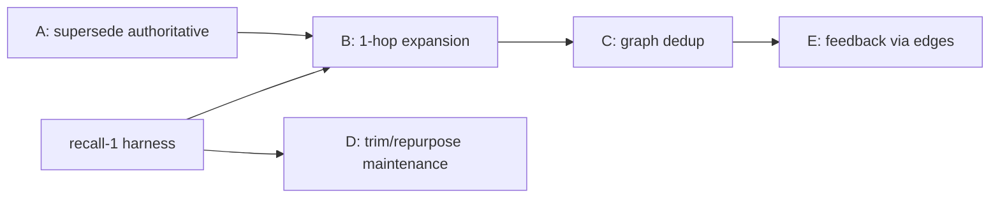

# Plan: Making the Memory Graph Earn Its Keep

> Status: **Partially landed.** Companion to MEMORY_ARCHITECTURE.md. Goal: best recall accuracy.
>
> - **Shipped:** recall-0 + recall-4 (hybrid dense + BM25 + RRF), recall-3 (focused query
>   construction), recall-5 Mode-2 (listwise LLM rerank) — and the shipped rerank went *beyond*
>   this plan by adding multi-judge consensus voting, a cadence gate, a verified-set carry and a
>   failure circuit breaker.
> - **Shipped since (not in the original plan):** the remote OpenAI embedding backend and the
>   dense vector-space gate.
> - **Unbuilt:** graph Phases A, B, C, D and E — every one of them. Nothing in the live turn path
>   reads graph structure today. recall-2 (embedder upgrade as a *quality* lever) and recall-6
>   (priors) remain deliberately deprioritized.
> - **Verified 2026-09-05.**

## Current reality (verified in code 2026-09-05)

- **Live automatic recall** (`memory_agent::process_context`, `memory_agent.rs:477`) uses
  `MemoryManager::find_similar_hybrid` (`memory.rs:642`) -> `hybrid_fuse` (`memory.rs:668`): dense
  cosine (no floor, vector-space gated) fused with `bm25_rank` (`memory.rs:1991`, K1 1.2 / B 0.75)
  by RRF with `RRF_K = 60` (`memory.rs:712`), top `EMBEDDING_MAX_HITS = 10` (`memory.rs:1982`).
  The old `find_similar_with_embedding` -> `score_and_filter` path with the 0.5 cosine floor is
  no longer on the live path (it survives only for the tool's `semantic`/`cascade` modes and
  skill retrieval, `memory.rs:830`). The per-candidate binary sidecar check and
  `evaluate_candidates` are gone entirely.
- Selection is now one **listwise consensus rerank** over the hybrid candidates
  (`memory_rerank::rerank_candidates_consensus_attributed`, `memory_rerank.rs:249`) driven by the
  focused query (`memory_prompt.rs:163`), capped at `MAX_MEMORIES_PER_TURN = 5`
  (`memory_agent.rs:45`).
- The **graph traversal** (`cascade_retrieve`, `jcode-memory-types/src/graph.rs:546`) is still only
  reachable from the `memory` tool — `find_similar_with_cascade_scoped` at
  `crates/jcode-app-core/src/tool/memory.rs:236` and `get_related` at `tool/memory.rs:411`. It
  contributes **nothing** to per-turn surfacing. Unchanged since this plan was written.
- Maintenance (`post_retrieval_maintenance`, `memory_agent.rs:1200`) still WRITES graph structure
  every turn (RelatesTo links at weight 0.6, co-relevance clusters + sidecar naming every 50 ticks,
  inferred tags, confidence boost/decay, pruning every 250 ticks) but the live path never READS most
  of it back.

So today the graph's edges/clusters/tags remain write-mostly. The parts that matter
(supersede/contradiction -> `active`, reinforcement strength, confidence gating the active set) help
data hygiene, not ranking.

## Goal: maximize recall accuracy in BOTH modes

Both modes are first-class targets. They share Stage 1 (candidate generation)
and the graph layer, but diverge at the quality/judgment stage. Strategy:
push as much accuracy as possible into the **shared local stack** (better
embedder, hybrid, query construction, graph rerank, priors) so Mode 1 gets
strong on its own, then let Mode 2's LLM add a final precision layer on top of
an already-good candidate set rather than compensating for a weak one.

### Shared local stack (lifts both modes)
- recall-2 better embedder + asymmetric prefixes — NOT shipped (deprioritized; see below)
- recall-3 focused query construction (current intent, not 8k blob) — **SHIPPED**
  (`focus_query_text`, `memory_prompt.rs:163`)
- recall-4 hybrid dense + BM25 + RRF — **SHIPPED** (`hybrid_fuse`, `memory.rs:668`)
- recall-6 recency/confidence/strength/scope priors in the score — NOT shipped (evaluated, neutral)
- Phases A-C graph: supersede-authoritative, 1-hop expansion, dedup — NOT shipped
- A local cross-encoder reranker (small, on-device) as the Mode 1 top stage — evaluated and
  **REJECTED** (out-of-distribution, recall@5 0.325 vs hybrid 0.530)

### Mode 1 (no LLM) - get it as close to Mode 2 as possible — NOT achieved
- Original target: replace raw-cosine top-5 with hybrid recall -> graph expansion -> local
  cross-encoder rerank -> priors -> calibrated cutoff.
- What actually landed: hybrid recall + a score-gap cutoff (`dynamic_gate_select`). The
  cross-encoder was benchmarked and rejected, graph expansion was never built, and priors were
  evaluated as neutral. Mode 1 therefore still has no quality layer above first-stage retrieval.
- Still open: cheap local query expansion (synonyms/identifier splitting), and a calibrated
  per-mode cutoff to replace the heuristic gap gate.

### Mode 2 (LLM) - add precision, don't redo recall — SHIPPED (rerank half)
- Landed: one **listwise** rerank over the hybrid candidate set with the focused query, replacing
  the old independent per-candidate binary calls. It then grew beyond this plan into an
  N-judge consensus vote with a cadence gate, verified-set carry and a circuit breaker.
- NOT landed: graph/cross-encoder stages feeding the rerank (the candidate set is hybrid-only),
  LLM query rewriting / HyDE at Stage 0, and any explicit contradiction arbitration.

### Why this was supposed to converge both — it has not
The intended story: Mode 1 rises to "best offline retriever + cross-encoder", Mode 2 starts from that
same ceiling and adds listwise judgment. Because the cross-encoder was rejected and no graph stage
shipped, Mode 1 stalled at hybrid-plus-gap-gate (~0.53 recall@5) while Mode 2 reached ~0.75. The gap
between modes is currently the LLM judge, not a shared local ceiling. The harness (recall-1) still
tracks both columns.

## Two operating modes (gate: `agents.memory_sidecar_enabled`, env `JCODE_MEMORY_SIDECAR_ENABLED`, **default ON**)

The gate defaults to `true` (`default_memory_sidecar_enabled`,
`crates/jcode-config-types/src/lib.rs:612`, field at `:555`; env override at
`crates/jcode-base/src/config/env_overrides.rs:385`). The earlier "default off" claim in this plan
was wrong: Mode 2 is the shipped default because the LLM precision judge is the only mode that is
reliably productive, and Mode 1 is now an explicit opt-out. A third state exists: sidecar mode
configured but no LLM backend reachable, in which case memory goes **dormant** for the turn rather
than degrading to Mode 1 (`memory::memory_runtime_active`, `memory.rs:144`, checked at
`memory_agent.rs:493`).

### Mode 1 - Sidecar OFF (embedding-only, no LLM) - explicit opt-out
- Surfacing: `select_top_candidates_no_sidecar` (`memory_agent.rs:886`) ->
  `dynamic_gate_select` (`memory_agent.rs:71`). This is no longer raw-cosine top-5: it walks the
  **hybrid** ranking and cuts at the first score gap (`GATE_REL_FLOOR = 0.90`,
  `GATE_DROP_RATIO = 0.95`, `memory_agent.rs:61-62`), returning a variable 1..=5. No LLM
  relevance verification, no listwise judgment. `evaluate_candidates` no longer exists.
- Extraction: `extract_from_context` and final extraction are **skipped** (both require a live
  sidecar, `memory_agent.rs:935`). Memories are created ONLY via the explicit `memory` tool.
- Cluster naming: falls back to `infer_candidate_tag` (heuristic, no LLM;
  `name_cluster_with_sidecar`, `memory_agent.rs:1400`).
- Net: fully local, zero LLM cost; weakest precision and no auto memory growth.

### Mode 2 - Sidecar ON (LLM-assisted) - the default
- Surfacing: ONE listwise consensus rerank per fired turn, not per-candidate binary checks.
  `rerank_candidates_consensus_attributed` (`memory_rerank.rs:249`) runs
  `agents.memory_rerank_votes` judges concurrently (default 2) and keeps only memories selected by
  at least `agents.memory_rerank_min_agree` of them (default 2)
  (`jcode-config-types/src/lib.rs:568-573`, defaults at `:620-626`).
- Cadence: the expensive rerank fires at most once every `agents.memory_rerank_cadence` turns
  (default 3, `jcode-config-types/src/lib.rs:561`, `:616`); a topic change or a session's first
  rerank always fires (`should_run_rerank`, `memory_agent.rs:314`).
- Failure policy: any judge failure yields an EMPTY set (`RerankOutcome`, `memory_rerank.rs:208`)
  and the caller carries the last judge-verified set (`carry_verified`, `memory_agent.rs:909`)
  instead of injecting unvetted hybrid order; a circuit breaker suppresses retry storms
  (`memory_rerank.rs:256`).
- Extraction: auto-extract on topic change + every `PERIODIC_EXTRACTION_INTERVAL = 12` turns
  (`memory_agent.rs:293`) + session end (`trigger_final_extraction_with_dir`,
  `memory_agent.rs:1853`), with LLM dedup/contradiction checks.
- Maintenance: LLM-named clusters, contradiction detection.

### Implications for this plan
- Every recall improvement must be evaluated in BOTH modes (recall-1 harness
  should report two columns).
- Phases A-C (graph as reranker/dedup/expansion) are **pure local** and would benefit
  Mode 1 the most, since Mode 1 still has no quality layer beyond the hybrid ranking and its gap gate.
- recall-5 (rerank) shipped for Mode 2 only. The Mode-1 local cross-encoder half was benchmarked
  and rejected, so Mode 1 has no rerank stage and the two modes have NOT converged.
- Phase D maintenance trimming primarily affects Mode 2 cost (cluster naming is
  the LLM line item); Mode 1 already uses the heuristic fallback.

## Edge types and what each is good for

| Edge          | Source of truth | Use in recall |
|---------------|-----------------|----------------|
| `Supersedes`  | contradiction/dedup on write | Keep ONLY newest version in results; demote/hide superseded |
| `Contradicts` | sidecar on write | Surface both + flag conflict; never silently pick one |
| `RelatesTo`   | co-relevance maintenance | 1-hop expansion to rescue near-misses |
| `DerivedFrom` | co-extraction | 1-hop expansion (procedures <-> facts) |
| `HasTag`      | user + inference | Lexical/filter signal, scope narrowing |
| `InCluster`   | auto clustering | Weakest; diversity/dedup at best |

## Design principle

Use the graph as a **structural reranker / recall-rescue layer**, NOT as the
primary retriever. Embeddings (+ future hybrid) generate candidates; the graph
re-scores and expands them. This is where graphs reliably help in RAG: relating,
deduping, and rescuing, not first-stage recall.

## Target live pipeline

Stage 1 is the only stage that exists today.

```
Stage 1  Candidate generation                                      [SHIPPED]
          dense cosine (no floor, vector-space gated) + BM25, fused by RRF;
          per-retriever pool max(limit*5, 50), top 10 handed downstream

Stage 2  Graph expansion (1-hop only)                              [NOT BUILT]
          for each seed, pull neighbors via Supersedes / RelatesTo / DerivedFrom
          score_neighbor = seed_score * edge_weight * depth_decay
          this rescues relevant memories that embedding alone missed

Stage 3  Graph-aware dedup/canonicalize                            [NOT BUILT]
          collapse Supersedes chains -> keep newest active only
          group near-duplicate cluster members -> representative + count

Stage 4  Rerank + priors                                           [PARTIAL]
          listwise consensus rerank SHIPPED (Mode 2 only);
          priors (confidence / strength / recency / scope) and a calibrated
          cutoff NOT shipped - Mode 2 uses the judge's own cut, Mode 1 a gap gate
```

## Phased plan — **none of Phases A-E is built**

Verified 2026-09-05: nothing in `process_context` (`memory_agent.rs:477`) reads graph edges, and
`cascade_retrieve` has no live-path caller. The phases below remain as originally written.

### Phase A - Make supersede/contradiction authoritative in live recall (cheap, high value) — NOT BUILT
- Post-filter live results through the graph: drop any memory whose `superseded_by` is set or that
  has an incoming `Supersedes` edge from an active memory. (The original text named
  `score_and_filter`; the live path now goes through `hybrid_fuse` (`memory.rs:668`) and
  `process_context` (`memory_agent.rs:477`), so the filter belongs there. Note `hybrid_fuse` already
  restricts the pool to `active_memories()`, so a superseded memory whose `active` flag was cleared
  is already excluded — the gap is superseded-but-still-active chains and edge-only supersession.)
- Surface `Contradicts` pairs together with a conflict flag instead of letting the judge or the
  hybrid ranking arbitrarily pick one.
- Verifiable: unit test with a superseded chain; assert only newest surfaces.

### Phase B - Wire 1-hop graph expansion into the live path — NOT BUILT
- Add a `cascade=true` mode to the live retrieval (reuse `cascade_retrieve` but
  cap depth=1 and restrict edges to Supersedes/RelatesTo/DerivedFrom; exclude
  InCluster/HasTag fan-out which explode candidate count).
- Feed expanded set into the reranker, not directly to output.
- Verifiable (needs recall-1 harness): recall@5 with vs without expansion.

### Phase C - Graph-aware dedup before surfacing — NOT BUILT
- Collapse Supersedes/near-dup cluster members so the 5 surfaced slots aren't
  wasted on restatements of one fact. Improves effective precision and recall.

### Phase D - Decide the fate of expensive maintenance — NOT DECIDED, maintenance still runs in full
- Auto-clustering + sidecar cluster-naming + tag inference currently cost LLM
  calls + full graph save per cycle and feed nothing into live recall.
- Options:
  1. Repurpose clusters for Phase C dedup/diversity (keeps them, drops naming).
  2. Cut cluster-naming + tag-inference entirely, redirect budget to embedder
     upgrade + hybrid + rerank (recall-2/4/5).
- Recommended: cut naming + tag-inference now; keep cluster centroids only if
  Phase C uses them. Keep confidence boost/decay, supersede, reinforcement.

### Phase E - Feedback loop closes via graph — NOT BUILT
- On inject + actual use, reinforce surfaced memories and strengthen the
  RelatesTo edges among co-used memories (already partly there). Once Phase B
  reads those edges, this feedback finally affects future recall.

## Cost to quantify first (before Phase D decision)
- Per maintenance cycle: # sidecar LLM calls (cluster naming), # graph load+save
  round-trips, bytes rewritten. Add a counter / log and measure on the real
  `~/.jcode/memory` graphs.

## Dependencies / ordering
- recall-1 (eval harness) gates B/C/D measurement.
- Phase A is independent and safe to do first (pure correctness win).
- Phases B/C should be measured against the harness; otherwise we're guessing.


## Implementation status (2026-06-14)

Benchmark (Mode 1, private ~/jcode-memory-bench, Sonnet judge):
- DONE: harness `memory_recall_bench` (queries/pool/judge/metrics), committed.
- Baseline: production dense (0.5 thr) = 0.0 recall@5; hybrid = 0.53.

Shipped to live path:
- DONE recall-0 + recall-4: memory agent uses `find_similar_hybrid`
  (dense + BM25 + RRF, no cosine floor). Removed the recall-killing 0.5 threshold
  and added lexical signal. Unit tests added. Bench: 0.0 -> 0.53 recall@5.

Evaluated, NOT shipped:
- recall-6 priors: roughly neutral (+1.8pt r@5 / -1.8pt r@10). Held back; bench
  config `hybrid_priors` retained for re-evaluation after embedder upgrade.

Next (high value, larger change) — status as of 2026-09-05:
- recall-2: embedder upgrade (dense half is weak at 0.17 unthresholded). NOT shipped as a quality
  lever; the remote-backend *plumbing* did ship (see follow-up 1).
- recall-3: focused query construction — **SHIPPED** (`focus_query_text`, `memory_prompt.rs:163`).
- recall-5: rerank stage — **SHIPPED for Mode 2** (`memory_rerank.rs:249`), plus consensus voting and
  cadence gating that were not in this plan. graph A-D: still zero graph utilization.

## Update 2026-06-14 (rerank breakthrough, multi-agent)

Benchmark-driven results (Sonnet judge, 28 judged queries, jcode self-dev corpus):
| Config       | recall@5 | recall@10 | precision@5 | MRR   |
|--------------|----------|-----------|-------------|-------|
| baseline (prod dense, 0.5 thr) | 0.000 | 0.000 | 0.000 | 0.000 |
| hybrid (SHIPPED)               | 0.530 | 0.679 | 0.229 | 0.504 |
| ce_rerank (local CE, rejected) | 0.325 | 0.420 | 0.129 | 0.322 |
| llm_rerank (listwise Sonnet)   | 0.754 | 0.832 | 0.346 | 0.762 |
| oracle ceiling                 | 0.990 | 1.000 | 0.443 | 1.000 |

- Hybrid (dense+BM25+RRF) shipped: 0.0 -> 0.53 recall@5.
- Local cross-encoder REJECTED (out-of-distribution, 0.325).
- Listwise LLM reranker over the hybrid top-50 with a FOCUSED query: 0.53 -> 0.75
  recall@5, captures most of the oracle headroom. This is the Mode-2 path.
- Embedder upgrade de-prioritized (pool recall already ~99%; bge anisotropic).

Implementation split (turtle + crocodile):
- Shared: jcode-base/src/memory_rerank.rs (prompt + parse + rerank_candidates),
  used by both bench and memory_agent (single source of truth).
- memory_agent process_context: Mode-2 reranks hybrid candidates with the focused
  query before surfacing; Mode-1 unchanged (no adequate local reranker).
- Focused query builder (focus_query_text) lands in memory_prompt.rs.

## Deferred follow-ups (2026-06-14, after the rerank pipeline shipped)

The two-stage pipeline (hybrid retrieve -> focused-query listwise LLM rerank ->
top-5) is live and committed; production recall@5 went 0.0 -> 0.53 -> ~0.75.
Status re-verified 2026-09-05: item 1 has since largely shipped; items 2 and 3 remain open.

1. **Remote embedding adapter** — **SHIPPED since this was written** (2026-09-05 verification).
   `OpenAiEmbeddingBackend` (`crates/jcode-base/src/embedding_backend.rs:110`) implements the
   `EmbeddingBackend` trait alongside `LocalOnnxBackend` (`:81`), and `active_backend()` (`:278`)
   auto-selects it when `agents.memory_embedding_backend = "openai"` AND an `OPENAI_API_KEY` is
   resolvable, silently degrading to local otherwise (`openai_backend_from_config`, `:287`). Config
   knobs: `memory_embedding_backend` / `memory_embedding_model` / `memory_embedding_base_url` /
   `memory_embedding_dim` (`crates/jcode-config-types/src/lib.rs:574-593`).
   What is still MISSING from the original item: the **re-embed migration**. There is no bulk
   re-embed command, so switching backends leaves existing memories in the old vector space; they
   stay reachable only through the BM25 half because `hybrid_fuse` gates the dense half on
   `effective_embedding_model() == active_model_id()` (`memory.rs:691-697`).
   The *quality* rationale is unchanged: the oracle-ceiling analysis showed the embedder is a
   *capped* lever (the candidate pool already contains ~99% of relevant memories; ranking, not
   pool recall, was the bottleneck). Only revisit the model choice if a future change makes the base
   embedder the bottleneck again, and A/B it in the bench first.

2. **Live Mode-2 verification** (operational, still open). The code path is committed and is the
   default (`memory_agent.rs:735` calls the consensus rerank; per-candidate binary checks no longer
   exist anywhere in the tree). What is still unrecorded is a real-session confirmation: memory logs
   showing one listwise rerank per fired turn, and the judge-outcome counters in
   `crates/jcode-base/src/memory_judge_metrics.rs` staying on `JudgeDecision::JudgeRan` (mapped
   from `RerankOutcome::Judged`, `memory_judge_metrics.rs:120`) rather than the
   `CadenceCarry` (`:51`) / failure paths.

3. **Alternate-judge re-run** (still open). Re-run the bench LLM judge on an OpenAI model
   (`--backend=openai --reasoning=none`, parsed at `src/bin/memory_recall_bench.rs:878` and `:887`)
   and compare judge agreement against the current Claude-Sonnet gold labels. Infrastructure is in
   place: `Sidecar::with_openai_model` (`sidecar.rs:251`) and `with_claude_model` (`sidecar.rs:238`),
   wired at `memory_recall_bench.rs:924-926`. The specific model named in the original note
   ("GPT-5.5") is not what the sidecar defaults to today — `SIDECAR_OPENAI_MODEL` is
   `gpt-5.6-luna` (`sidecar.rs:17`) — so pass `--model=` explicitly for a reproducible comparison.

## Fork-the-judge / KV-reuse reranker (validated design, future)

Idea (user, 2026-06-14): instead of a separate tiny sidecar call for the memory
rerank, reuse the main agent's warm transcript KV cache and run the reranker as
a branch off it, so the judge's marginal cost is just the rerank suffix.

Benchmark findings (claude-sonnet-4-6, 28 judged queries, see
~/jcode-memory-bench/results/BASELINE_SUMMARY.md):
- Naive (full transcript as the rerank query): QUALITY REGRESSION. recall@5
  0.81 -> 0.58, precision@5 0.34 -> 0.25. Noise dilutes even a frontier model.
- prefix_suffix (full transcript as prefix + focused intent appended as a
  suffix with a "focus on THIS" marker): FULLY RECOVERS quality. recall@5 0.811,
  precision@5 0.351, MRR 0.784 (>= the shipped focused-query rerank).

Conclusion:
- The cache-friendly structure (transcript-as-prefix for KV reuse) does NOT cost
  accuracy *if* the focused rerank instruction is appended as a suffix.
- SELF-HOSTED (vLLM/SGLang/Ollama): viable + high-quality. Fork the rerank
  sequence off the agent's warm transcript KV (SGLang fork / RadixAttention),
  append the focused rerank suffix + candidate list, decode a short ranked list.
  Near-free, full-model-quality reranking. Good basis for a local/premium memory
  path. Requires a server that exposes prefix sharing/forking.
- PROVIDER APIs (default): NOT a cost win (cached-read on a ~50k-token transcript
  prefix still costs ~10-20x a ~1k focused sidecar prompt, because the big
  model's per-token rate dominates), but no longer a quality regression. Could be
  exposed as an opt-in config "rerank with main model + prompt caching" for users
  who prioritize rerank quality and have caching enabled. Default stays the cheap
  focused-query sidecar, which wins on both cost and quality on the API path.

Bench repro: `memory_recall_bench metrics --config=llm_rerank
--query_view=focused|full|prefix_suffix --model=<model>`.
