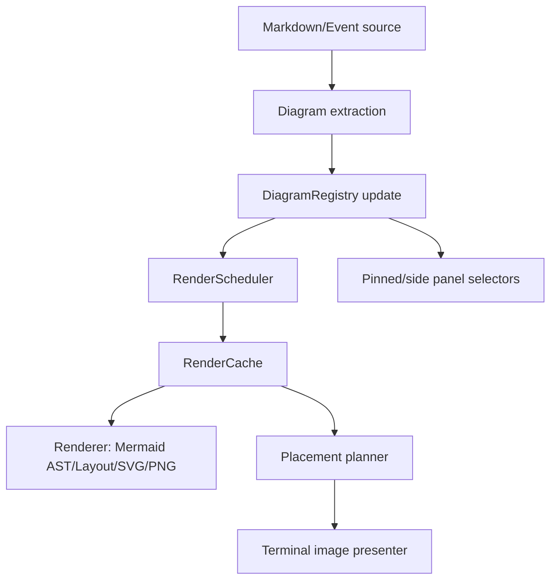

# ADR: Mermaid Rendering Redesign

Date: 2026-05-08
Status: **Proposed; largely unbuilt.** What landed from this ADR:

- The size-API path is real and is the default (see "Size API direction").
- The §1/§2 data model landed as types in
  `crates/jcode-tui-mermaid/src/mermaid_model.rs`, under different names, with
  cache-key normalization tests — but nothing in production constructs them
  yet, so they are declared vocabulary, not a pipeline.

What did **not** land: the staged pipeline itself. There is no
`DiagramRegistry`, no scheduler, no placement planner, and no presenter
module. `with_preferred_aspect_ratio`'s thread-local render profile
(`crates/jcode-tui-mermaid/src/lib.rs:127-130`, 19 call sites) and the
crate-global active-diagram vector
(`crates/jcode-tui-mermaid/src/mermaid_active.rs:42-141`) are both still
exactly as described under "Problem". Read §§3-6 and the migration plan as
design, not as description.

## Problem

The current Mermaid path is difficult to reason about because rendering, caching, UI placement, active diagram registration, deferred work, debug stats, and terminal image protocol state are coupled through global state and side effects.

Observed pain points:

- `jcode-tui-mermaid/src/lib.rs` is still a state hub despite the crate split.
- Markdown rendering decides Mermaid behavior directly, including streaming/deferred/side-only registration rules.
- Active diagrams are registered as a side effect of render calls, so simply preparing markdown mutates pinned-pane state.
- `with_preferred_aspect_ratio` uses thread-local state, so cache keys and render sizing depend on ambient context.
- The same diagram can be rendered in multiple contexts: chat inline placeholder, side panel image, pinned pane, streaming preview, debug probe. These contexts need different behavior but share low-level functions.
- Deferred rendering has its own dedupe/epoch/global queue and also performs active registration, increasing race risk.
- Image protocol rendering, PNG generation, image-state caches, and viewport rendering are mixed into the same public surface.

## Size API direction

The size-API path is **on by default**, not opt-in. Two conditions gate it and
both hold in a normal build:

- the `mmdr-size-api` Cargo feature, which is in `default`
  (`crates/jcode-tui-mermaid/Cargo.toml:8`, `mmdr-size-api = ["renderer"]` at
  `:13`); and
- the `mmdr_size_api_available` cfg, which `build.rs:10-12` emits **unless**
  `JCODE_MMDR_SIZE_API_DISABLE` is set — an opt-*out* for testing against an
  older renderer via a Cargo patch.

`JCODE_MMDR_SIZE_API_AVAILABLE=1` (which earlier revisions of this ADR named
as the enabling condition) is not an enabling condition at all: `build.rs:9`
only declares it for `rerun-if-env-changed` compatibility with old build
scripts and nothing reads it. The live guard expression everywhere is
`all(feature = "mmdr-size-api", mmdr_size_api_available)`
(`crates/jcode-tui-mermaid/src/lib.rs:25-34`, `:289`, `:331`, `:351-352`;
`mermaid_svg.rs:84` onward), with the pinned `mermaid-rs-renderer` tag
`v0.3.1` (`Cargo.toml:22`) supplying the API.

Landed from the direction below:

- The renderer asks the size API for measured dimensions on the default path;
  the SVG-retargeting path survives only under the `not(...)` arm of that same
  cfg, as intended.
- `render_size_backend()` (`crates/jcode-tui-mermaid/src/lib.rs:393-399`)
  reports `"mmdr-size-api"` or `"svg-retarget-fallback"` and is surfaced in
  debug stats (`mermaid_debug.rs:78`, field at `lib.rs:1151`).

Still open from the direction below:

- `calculate_render_size` is still authoritative for output dimensions rather
  than a target hint (`mermaid_cache_render.rs:783`, `mermaid_svg.rs:40`).
- Debug stats report the backend but nothing fails loudly in tests when the
  size-API path is expected and missing; the one size-API test is simply
  cfg'd out instead (`mermaid_tests/part_02.rs:88-90`).
- Cache keys are not yet built from normalized target/profile inputs in
  production; see the model-types note under "Migration plan".

This reduces bugs from aspect-ratio retargeting, blurry upscaling, placeholder height mismatch, and pane resize oscillation.

## Target design

Not built. The diagram below is the intended pipeline; none of its stages
exist as such today. The crate's actual modules are `active`,
`cache_render`, `content_render`, `debug_support`, `inline_image`, `model`,
`runtime`, `svg`, `viewport_render`, `widget_render`, and `debug`
(`crates/jcode-tui-mermaid/src/lib.rs:16-229`, `:1353`), with `lib.rs` still
the state hub.

Use an explicit, staged pipeline with pure data between stages:



### 1. Diagram extraction

Markdown renderers should only extract fenced Mermaid blocks into immutable descriptors:

```rust
struct DiagramBlock {
    id: DiagramId,
    source_hash: u64,
    source: Arc<str>,
    origin: DiagramOrigin,
    ordinal: usize,
}
```

They should not directly mutate active diagrams or synchronously render unless a caller explicitly asks for a blocking fallback.

**Landed, unwired.** `DiagramBlock`, `DiagramId`, and `DiagramOrigin` exist in
`crates/jcode-tui-mermaid/src/mermaid_model.rs:10-28`, with a tighter shape
than sketched here: `DiagramBlock` is `{ id, source }` and `source_hash` /
`origin` / `ordinal` live inside `DiagramId`. Nothing constructs them: they
are re-exported from `lib.rs:213-215` and re-exported again by
`crates/jcode-tui/src/tui/mermaid.rs:2-6`, and that is their only use.
Markdown rendering still registers active diagrams as a side effect.

### 2. Explicit render request

Replace ambient `with_preferred_aspect_ratio` and boolean parameters with one request object:

```rust
struct RenderRequest {
    diagram_id: DiagramId,
    source_hash: u64,
    source: Arc<str>,
    target: RenderTarget,
    profile: RenderProfile,
    priority: RenderPriority,
    mode: RenderMode,
}

struct RenderProfile {
    width_cells: Option<u16>,
    preferred_aspect_per_mille: Option<u16>,
    theme: MermaidTheme,
}

enum RenderMode {
    CacheOnly,
    EnqueueIfMissing,
    Blocking,
}
```

Cache keys should be built only from `source_hash + normalized RenderProfile`, never from thread-local context.

**Landed under different names, unwired.** `RenderRequest` is
`DiagramRenderRequest` (`mermaid_model.rs:110-124`), `RenderProfile` is
`DiagramRenderProfile` (`:35-59`), and the derived key is a first-class
`DiagramCacheKey` (`:67-86`); `RenderTarget`, `RenderPriority`, `RenderMode`,
`MermaidTheme`, and `normalize_aspect_ratio` are all there too. The
cache-key-from-`source_hash`-plus-normalized-profile property is tested
(`mermaid_model.rs:154-200`). But no production code builds a request or calls
`cache_key()`, and `with_preferred_aspect_ratio`
(`crates/jcode-tui-mermaid/src/lib.rs:127-130`) is still the live mechanism at
19 call sites, so real cache keys still come from thread-local context.

### 3. Registry owns active state

Introduce a `DiagramRegistry` owned by TUI app/session state, not a global Mermaid crate vector.

Responsibilities:

- Track diagrams visible in the current prepared transcript/side panel.
- Track streaming preview separately with a generation id.
- Publish the ordered list for pinned pane selection.
- Clear/update atomically per prepare pass.

Rendering should return `RenderArtifact`; it should never register active diagrams as a side effect.

**Not built.** There is no `DiagramRegistry`. Active and streaming-preview
diagram state is still a crate-global in
`crates/jcode-tui-mermaid/src/mermaid_active.rs:42-141`
(`register_active_diagram`, `set_streaming_preview_diagram`,
`clear_active_diagrams`, snapshot/restore), and rendering still registers as a
side effect. `RenderArtifact` exists as a type (`mermaid_model.rs:126-132`)
but is not returned by any renderer.

### 4. Scheduler owns async/deferred behavior

A scheduler receives explicit requests and returns one of:

```rust
enum RenderStatus {
    Ready(RenderArtifact),
    Pending { request_id: RenderRequestId },
    Failed(RenderError),
    ProtocolUnavailable,
}
```

Rules:

- Deduplication is by full cache key.
- Workers do not mutate active registry.
- Worker completion only publishes `MermaidRenderCompleted` plus artifact metadata.
- Epoch invalidation is scoped to request generations, not one global counter unless truly necessary.

**Not built.** There is no scheduler. `RenderStatus`/`RenderError` exist as
types (`mermaid_model.rs:134-146`) with no producer, and the landed
`RenderStatus::Pending` is keyed by `cache_key`, not by a `RenderRequestId`
(that type was never created). The nearest live mechanism is the completion
hook `set_render_completed_hook`
(`crates/jcode-tui-mermaid/src/lib.rs:161`), not a `MermaidRenderCompleted`
event.

### 5. Placement planner is separate from rendering

Markdown/side-panel preparation should insert placeholders based on `RenderStatus` and desired placement:

- Inline image placeholder lines for chat/side panel.
- Sidebar marker for side-only mode.
- Error block for failed render.
- Pending placeholder for deferred/streaming render.

Image widget rendering should consume `RenderArtifact` plus `PlacementPlan`, not know Mermaid source or render scheduling.

**Not built.** No `PlacementPlan` type and no placement module.

### 6. Public module boundaries

Recommended crate modules:

- `model.rs`: `DiagramId`, `DiagramBlock`, `RenderProfile`, `RenderTarget`, `RenderArtifact`, `RenderStatus`, errors.
- `extract.rs`: Markdown Mermaid block extraction helpers.
- `cache.rs`: disk and memory artifact metadata cache.
- `renderer.rs`: Mermaid parse/layout/SVG/PNG conversion only.
- `scheduler.rs`: request queue, worker, dedupe, completion events.
- `registry.rs`: active/streaming diagram state, ideally app-owned.
- `placement.rs`: placeholder/image-region planning.
- `presenter.rs`: ratatui-image/Kitty/Sixel/iTerm viewport rendering.
- `debug.rs`: stats collected from explicit events.

Of these, only `model.rs` exists (as `mermaid_model.rs`) and `debug.rs`.
`extract.rs`, `cache.rs`, `renderer.rs`, `scheduler.rs`, `registry.rs`,
`placement.rs`, and `presenter.rs` were never created; their responsibilities
are still spread across `mermaid_cache_render.rs`, `mermaid_svg.rs`,
`mermaid_content.rs`, `mermaid_inline.rs`, `mermaid_viewport.rs`,
`mermaid_widget.rs`, and `mermaid_active.rs`.

## Migration plan

1. Add explicit model types and cache key normalization tests. **Done**
   (`crates/jcode-tui-mermaid/src/mermaid_model.rs`), but the types have no
   production callers, so this is step 1 of 7 with nothing standing on it.
2. Add a new scheduler API while keeping old wrappers. *Not started.*
3. Convert `render_mermaid_sized_internal` into pure-ish
   `renderer::render_to_png(request) -> RenderArtifact`. *Not started.*
4. Move active diagram writes out of render functions into markdown
   prepare/app registry updates. *Not started.*
5. Replace `with_preferred_aspect_ratio` call sites with explicit
   `RenderProfile` plumbing. *Not started* (19 call sites remain).
6. Split presenter/image-state code from PNG rendering code. *Not started.*
7. Delete old boolean wrapper APIs and thread-local render profile.
   *Not started.*

## Validation criteria

- Unit tests for cache key normalization and filename parsing. Cache-key
  normalization is covered (`mermaid_model.rs:154-200`); the rest are not.
- Unit tests for registry update ordering, streaming preview replacement, and atomic clear/update.
- Scheduler tests for dedupe, cache-hit, cache-miss pending, worker completion, and no active-state mutation.
- Markdown renderer tests that Mermaid blocks produce deterministic placeholders without global side effects.
- Existing scroll/pinned-pane tests still pass.
- A debug probe can render a diagram with explicit profile and report the exact cache key used.

## Near-term safe refactor

Before a full migration, the highest ROI change is to introduce explicit request/status types and make old public functions thin compatibility wrappers. That lets us migrate call sites one at a time while reducing new bugs from additional boolean/thread-local behavior.
